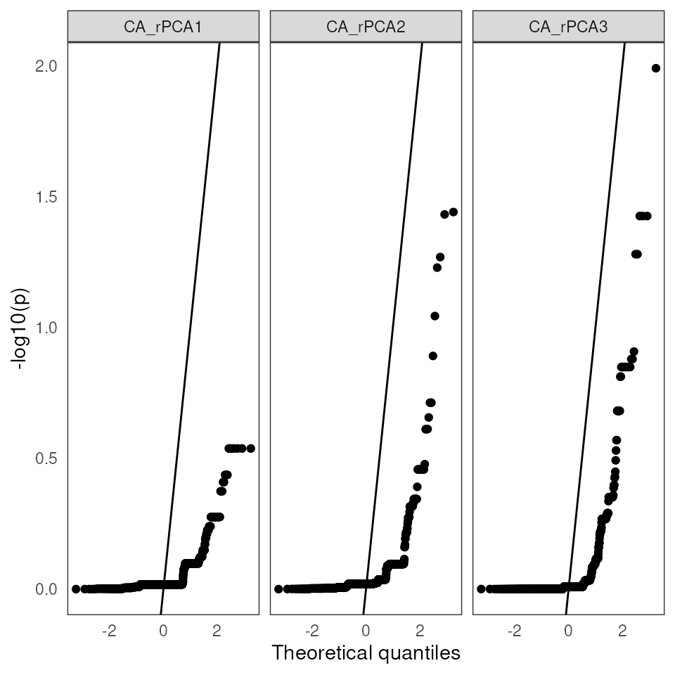

# LFMM

## Latent factor mixed models (LFMM)

``` r

library(algatr)
```

``` r

# Install required packages
lfmm_packages()
```

``` r

library(here)
library(raster)
```

**If using LFMM, please cite the following: for the LFMM method, Caye et
al. 2019. For the `lfmm` package, please cite Jumentier B. (2021). lfmm:
Latent Factor Mixed Models. R package version 1.1.**

LFMM ([Frichot et
al. 2013](https://academic.oup.com/mbe/article/30/7/1687/972098)) is a
genotype-environment association (GEA) method in which mixed models are
used to determine loci that are significantly associated with
environmental variables. This method is similar to performing RDA,
except that LFMM takes into account – and corrects for – unobserved
variables that may confound results (known as latent factors). A good
example of a latent factor that we may want to correct for prior to
examining environment-associated loci is population structure.

There are a variety of ways to determine the best number of latent
factors in LFMM (which are called K values, although these are *not* the
same as TESS K values). algatr provides the option to test using four
such methods: (1) Tracy-Widom test; (2) quick elbow test (i.e., scree
test); (3) using the clustering algorithm from TESS (i.e., determining
latent factors corresponding to some measure of population structure);
and (4) K-means clustering. We will explore each of these, and compare
results, in this vignette.

Importantly, as with RDA, LFMM cannot take in missing values. Imputation
based on the per-site median is commonly performed, but there are
several other ways researchers can deal with missing values. For
example, algatr contains the
[`str_impute()`](https://thewanglab.github.io/algatr/reference/str_impute.md)
function to impute missing values based on population structure using
the [`LEA::impute()`](https://rdrr.io/pkg/LEA/man/impute.html) function.
However, here, we’ll impute on the median, but strongly urge researchers
to use extreme caution when using this form of simplistic imputation. We
mainly provide code to impute on the median for testing datasets and
highly discourage its use in further analyses (please use
[`str_impute()`](https://thewanglab.github.io/algatr/reference/str_impute.md)
instead!).

To perform an LFMM analysis ([Caye et
al. 2019](https://academic.oup.com/mbe/article/36/4/852/5290100)),
algatr uses the lfmm package (see
[here](https://bcm-uga.github.io/lfmm/index.html) for details). Despite
its name, this package implements the LFMM2 method, which is similar to
the original LFMM algorithm, but is computationally faster. The LEA
package ([Frichot & Francois 2015](https://rdrr.io/bioc/LEA/)) also
provides a wrapper for lfmm2 using the `lfmm2()` function.

#### Read in and process data files

To run LFMM, we will need a genotype dosage matrix and environmental
values extracted at sampling coordinates. Let’s load the example
dataset, convert the vcf to a dosage matrix using the
[`vcf_to_dosage()`](https://thewanglab.github.io/algatr/reference/vcf_to_dosage.md)
function, and extract environmental data for our sampling coordinates
from our environmental raster stack (CA_env).

``` r

load_algatr_example()
#> 
#> ---------------- example dataset ----------------
#>  
#> Objects loaded: 
#> *liz_vcf* vcfR object (1000 loci x 53 samples) 
#> *liz_gendist* genetic distance matrix (Plink Distance) 
#> *liz_coords* dataframe with x and y coordinates 
#> *CA_env* RasterStack with example environmental layers 
#> 
#> -------------------------------------------------
#> 
#> 
# Convert vcf to dosage matrix
gen <- vcf_to_dosage(liz_vcf)
#> Loading required namespace: vcfR
#> Loading required namespace: adegenet
# Also, our code assumes that sample IDs from gendist and coords are the same order; be sure to check this before moving forward!
env <- raster::extract(CA_env, liz_coords)
```

As mentioned above, LFMM requires that your genotype matrix contains no
missing values. Let’s impute missing values based on the per-site
median. *N.B.: this type of simplistic imputation is strongly not
recommended for downstream analyses and is used here for example’s
sake!*

``` r

# Are there NAs in the data?
gen[1:5, 1:5]
#>        Locus_10 Locus_15 Locus_22 Locus_28 Locus_32
#> ALT3          0        0        0        0        0
#> BAR360        0        0        0       NA        0
#> BLL5          0       NA        0        0       NA
#> BNT5          0        0       NA       NA        0
#> BOF1          0       NA       NA       NA       NA
gen <- simple_impute(gen)
# Check that NAs are gone
gen[1:5, 1:5]
#>        Locus_10 Locus_15 Locus_22 Locus_28 Locus_32
#> ALT3          0        0        0        0        0
#> BAR360        0        0        0        0        0
#> BLL5          0        0        0        0        0
#> BNT5          0        0        0        0        0
#> BOF1          0        0        0        0        0
```

### Determining the number of latent factors using `select_K()`

------------------------------------------------------------------------

LFMM requires a user to define the number of latent factors (K values).
algatr provides options to perform four types of K selection using the
`K_selection` parameter within the
[`select_K()`](https://thewanglab.github.io/algatr/reference/select_K.md)
function:

- `K_selection = "tracy_widom"`: A Tracy-Widom test is performed.
  Briefly, this method finds significant eigenvalues of a matrix after
  performing a PCA. This argument uses the
  [`tw()`](https://thewanglab.github.io/algatr/reference/tw.md) function
  within the
  [AssocTests](https://cran.r-project.org/web/packages/AssocTests/index.html)
  package, and also requires a user to provide the `criticalpoint`,
  which corresponds to the significance level. Significance levels of
  alpha=0.05, 0.01, 0.005, or 0.001 correspond to critical point values
  of 0.9793, 2.0234, 2.4224, or 3.2724, respectively. The default
  significance level is 0.01, so the default for the `criticalpoint`
  parameter is 2.0234. The Tracy-Widom test is also the default method
  for the
  [`select_K()`](https://thewanglab.github.io/algatr/reference/select_K.md)
  function.

- `K_selection = "quick_elbow"`: A “quick elbow” is found automatically,
  which refers to a large percent drop in eigenvalues given a variance
  below 5% for each principal component (essentially the same as a scree
  test). The code to determine a quick elbow is adapted from that
  developed by Nicholas Cooper
  [here](https://rdrr.io/cran/bigpca/man/quick.elbow.html). This
  argument requires users to set the threshold that defines whether a
  principal component explains ‘much’ of the variance using the `low`
  argument, and also the maximum percentage of the variance to capture
  before the elbow (i.e., the cumulative sum to PC ‘n’) using the
  `max.pc` argument. The default for `low` is 0.08, and the default for
  `max.pc` is 0.90.

- `K_selection = "tess"`: The automatic K selection is performed after
  running TESS. This method minimizes the slope of the line that
  connects cross-entropy scores between K values. This approach is
  described
  [here](https://chazhyseni.github.io/NALgen/post/determining_bestk/).
  This argument requires users to provide coordinates (`coords`) and set
  the range of K values to test (`Kvals`; defaults to 1:10).

- `K_selection = "find_clusters"`: Uses K-means clustering to detect the
  number of clusters that best describe the data; this uses the
  `find.clusters()` function in the
  [adegenet](https://cran.r-project.org/web/packages/adegenet/index.html)
  package. For this method, the data are first transformed using a PCA,
  after which successive K-means clustering is run with an increasing
  number of K values. The “best” K is selected using the `"diffNgroup`”
  criterion in adegenet’s `find.clusters` function. algatr’s
  `"find_clusters"` argument requires users to set several parameters
  for both the PCA and the K-means clustering steps:

  - The user must specify the minimum amount of the total variance to be
    preserved by the retained axes using the `perc.pca` argument. The
    default for this argument is 90%.

  - The maximum number of clusters to be tested using the `max.n.clust`
    parameter; the default for this is 10.

There are more options within the `find.clusters` function in adegenet,
but we’ve chosen to include only some of them in algatr (e.g., the
`pca.select` argument is set to `"percVar"`). Please refer to the
adegenet documentation for further information.

Let’s see how the above methods compare to one another in terms of how K
values compare. Regardless of the K selection that’s done, a user must
provide a dosage matrix (`gen`) and the K selection procedure they would
like to perform (`K_selection`).

``` r

# Keep relevant params but retain default values for them
select_K(gen, K_selection = "tracy_widom", criticalpoint = 2.0234) # 6
#> [1] 6

select_K(gen, K_selection = "quick_elbow", low = 0.08, max.pc = 0.90) # 3
```


    #> [1] 3

    select_K(gen, K_selection = "tess", coords = liz_coords, Kvals = 1:10) # 3
    #> == Computing spectral decomposition of graph laplacian matrix: done
    #> ==Main loop with 1 threads: done
    #> == Computing spectral decomposition of graph laplacian matrix: done
    #> ==Main loop with 1 threads: done
    #> == Computing spectral decomposition of graph laplacian matrix: done
    #> ==Main loop with 1 threads: done
    #> == Computing spectral decomposition of graph laplacian matrix: done
    #> ==Main loop with 1 threads: done
    #> == Computing spectral decomposition of graph laplacian matrix: done
    #> ==Main loop with 1 threads: done
    #> == Computing spectral decomposition of graph laplacian matrix: done
    #> ==Main loop with 1 threads: done
    #> == Computing spectral decomposition of graph laplacian matrix: done
    #> ==Main loop with 1 threads: done
    #> == Computing spectral decomposition of graph laplacian matrix: done
    #> ==Main loop with 1 threads: done
    #> == Computing spectral decomposition of graph laplacian matrix: done
    #> ==Main loop with 1 threads: done
    #> == Computing spectral decomposition of graph laplacian matrix: done
    #> ==Main loop with 1 threads: done


    #> [1] 3

    select_K(gen, K_selection = "find_clusters", perc.pca = 90, max.n.clust = 10) # 4
    #> [1] 3

As you can see, the K selection method has quite an effect on the best
number of latent factors discovered in the data. For this vignette,
let’s move forward with the best K from the default method (Tracy-Widom
test), which means **K = 6**.

### Comparing different LFMM methods with `lfmm_run()`

------------------------------------------------------------------------

The main function in algatr that runs LFMM is
[`lfmm_run()`](https://thewanglab.github.io/algatr/reference/lfmm_run.md).
This function requires that users provide the dosage matrix (`gen`), the
extracted environmental variables (`env`), the number of latent factors
(`K`), and the LFMM method (`lfmm_method`).

Importantly, LFMM can be performed using two main methods (`"lasso"` or
`"ridge"`), which primarily differ in the penalized loss functions that
are incorporated into the least-squares minimization and are specified
using the `lfmm_method` argument. The least-squares minimization is how
statistical significance is determined for SNPs being associated with
environmental variables. The primary difference between the two methods
is that the ridge method minimizes the problem with an L^2 penalty,
whereas the lasso method minimizes with an L^1 penalty. According to
[Caye & François
2017](https://bcm-uga.github.io/lfmm/articles/lfmm#starting-with-lfmm),
a user would want to select the lasso method (i.e., L^1-norm) to induce
“sparsity on the fixed effects, and corresponds to the prior information
that not all response variables may be associated with the variables of
interest. More specifically, the prior implies that a limited number of
rows of the effect size matrix B are effectively non-zero.” The ridge
penalty is further described in [Caye et
al. 2019](https://academic.oup.com/mbe/article/36/4/852/5290100).

One other argument to be aware of within
[`lfmm_run()`](https://thewanglab.github.io/algatr/reference/lfmm_run.md)
is the adjustment of p-values, specified using `p_adj`. There are two
options for `p_adj`: `"fdr"`, which adjusts calibrated p-values based on
the false discovery rate (the default). Other options for p-value
adjustment can be found within the
[`p.adjust()`](https://rdrr.io/r/stats/p.adjust.html) function in the
stats package.

Finally, the last argument to be aware of within
[`lfmm_run()`](https://thewanglab.github.io/algatr/reference/lfmm_run.md)
is `calibrate`, which calibrates p-values based on resulting z-scores.
There are two options for this argument: `"gif"` (the default), and
`"median+MAD"`. From the LFMM documentation: “If the”gif” option is set
(default), significance values are calibrated by using the genomic
control method. Genomic control uses a robust estimate of the variance
of z-scores called “genomic inflation factor”. If the “median+MAD”
option is set, the pvalues are calibrated by computing the median and
MAD of the zscores. If NULL, the pvalues are not calibrated.”

Now that we’ve identified the number of latent factors to provide in our
model, let’s run LFMM using both ridge and lasso penalties with default
settings (i.e., FDR p-value adjustment and the “gif” calibration).

``` r

ridge_results <- lfmm_run(gen, env, K = 6, lfmm_method = "ridge")
lasso_results <- lfmm_run(gen, env, K = 6, lfmm_method = "lasso")
```

The results object from
[`lfmm_run()`](https://thewanglab.github.io/algatr/reference/lfmm_run.md)
contains 5 elements:

- `lfmm_snps`: a list of candidate SNPs that are statistically
  significantly associated with environmental variables, including all
  relevant information pertaining to the LFMM analysis (e.g., p-values,
  fixed effects, etc.)

- `df`: all of the SNPs and their associations, including all relevant
  information pertaining to the LFMM analysis

- `model`: parameters of the LFMM model, including matrices ***B***,
  ***U***, and ***V***

- `lfmm_test_result`: results from association testing

- `K`: the number of latent factors that LFMM was run using (in our
  case, 6)

### Visualizing LFMM results

------------------------------------------------------------------------

There are three main ways we can visualize the results from our LFMM
analysis. Each of these is automatically produced by
[`lfmm_run()`](https://thewanglab.github.io/algatr/reference/lfmm_run.md),
but you can produce them individually as well with the functions below.

- [`lfmm_table()`](https://thewanglab.github.io/algatr/reference/lfmm_table.md):
  Build a table with each SNP and its association (and p-value) with
  each environmental variable. This function allows for quite a bit of
  customization in terms of what is displayed:

  - `sig`: the significance threshold (alpha value)

  - `sig_only`: whether to only display SNPs above the significance
    threshold

  - `top`: if there are SNPs that are significantly associated with
    multiple environmental variables, only display the top association
    (i.e., variable with the maximum B value)

  - `order`: whether to order the SNPs in descending order based on
    their B value, otherwise they will be ordered based on environmental
    variable

  - `var`: only display SNPs associated with one environmental variable

  - `nrow`: the number of rows to display

  - `digits`: the number of decimal places to include

  - `footnotes`: whether to include footnotes describing the variables
    displayed

  - `p_adj`: whether p-values were adjusted in
    [`lfmm_run()`](https://thewanglab.github.io/algatr/reference/lfmm_run.md)

- [`lfmm_qqplot()`](https://thewanglab.github.io/algatr/reference/lfmm_qqplot.md):
  Build a QQ-plot (quantile-quantile plot) which plots expected
  quantiles (percentiles) against p-values.

- [`lfmm_manhattanplot()`](https://thewanglab.github.io/algatr/reference/lfmm_manhattanplot.md):
  Build a Manhattan plot with defined significance threshold.

#### Building a table of SNP associations with `lfmm_table()`

Let’s see what the top candidate SNPs were for each of our LFMM runs:

``` r

# Build tables for each of our LFMM runs, displaying only significant SNPs and ordering according to effect size (B)
lfmm_table(lasso_results$df, order = TRUE)
```

| snp | variable | B¹ | z-score | p-value | calibrated z-score | calibrated p-value | adjusted p-value |
|----|----|----|----|----|----|----|----|
| Locus_2338 | CA_rPCA3 | -0.26 | -4.44 | 0 | 19.19 | 0 | 0.01 |
| Locus_125 | CA_rPCA3 | 0.18 | 3.80 | 0 | 14.09 | 0 | 0.04 |
| Locus_859 | CA_rPCA3 | 0.18 | 3.80 | 0 | 14.09 | 0 | 0.04 |
| Locus_249 | CA_rPCA2 | 0.14 | 4.95 | 0 | 16.78 | 0 | 0.04 |
| Locus_1051 | CA_rPCA3 | 0.09 | 3.80 | 0 | 14.09 | 0 | 0.04 |
| Locus_562 | CA_rPCA2 | -0.05 | -4.74 | 0 | 15.42 | 0 | 0.04 |
| ¹ LFMM effect size |  |  |  |  |  |  |  |

``` r

lfmm_table(ridge_results$df, order = TRUE)
```

| snp | variable | B¹ | z-score | p-value | calibrated z-score | calibrated p-value | adjusted p-value |
|----|----|----|----|----|----|----|----|
| Locus_2338 | CA_rPCA3 | -0.29 | -5.25 | 0 | 25.50 | 0 | 0.00 |
| Locus_125 | CA_rPCA3 | 0.17 | 4.08 | 0 | 15.43 | 0 | 0.02 |
| Locus_859 | CA_rPCA3 | 0.17 | 4.08 | 0 | 15.43 | 0 | 0.02 |
| Locus_2947 | CA_rPCA2 | -0.13 | -7.49 | 0 | 38.03 | 0 | 0.00 |
| Locus_512 | CA_rPCA3 | 0.13 | 3.85 | 0 | 13.71 | 0 | 0.03 |
| Locus_2014 | CA_rPCA3 | 0.13 | 3.85 | 0 | 13.71 | 0 | 0.03 |
| Locus_1524 | CA_rPCA2 | -0.12 | -4.84 | 0 | 15.89 | 0 | 0.00 |
| Locus_249 | CA_rPCA2 | 0.12 | 5.92 | 0 | 23.78 | 0 | 0.00 |
| Locus_2338 | CA_rPCA2 | -0.11 | -4.00 | 0 | 10.84 | 0 | 0.03 |
| Locus_2133 | CA_rPCA2 | -0.10 | -6.45 | 0 | 28.25 | 0 | 0.00 |
| Locus_831 | CA_rPCA2 | -0.10 | -5.07 | 0 | 17.46 | 0 | 0.00 |
| Locus_2669 | CA_rPCA2 | -0.09 | -5.29 | 0 | 18.98 | 0 | 0.00 |
| Locus_2703 | CA_rPCA2 | 0.09 | 4.02 | 0 | 10.97 | 0 | 0.03 |
| Locus_1278 | CA_rPCA2 | -0.09 | -5.48 | 0 | 20.33 | 0 | 0.00 |
| Locus_786 | CA_rPCA2 | -0.09 | -4.31 | 0 | 12.61 | 0 | 0.01 |
| Locus_1318 | CA_rPCA2 | -0.09 | -6.51 | 0 | 28.74 | 0 | 0.00 |
| Locus_1051 | CA_rPCA3 | 0.09 | 4.08 | 0 | 15.43 | 0 | 0.02 |
| Locus_2045 | CA_rPCA2 | -0.08 | -5.72 | 0 | 22.21 | 0 | 0.00 |
| Locus_1319 | CA_rPCA2 | -0.08 | -5.59 | 0 | 21.15 | 0 | 0.00 |
| Locus_1745 | CA_rPCA2 | -0.08 | -5.59 | 0 | 21.15 | 0 | 0.00 |
| Locus_2670 | CA_rPCA2 | -0.08 | -6.91 | 0 | 32.38 | 0 | 0.00 |
| Locus_138 | CA_rPCA2 | 0.08 | 4.66 | 0 | 14.73 | 0 | 0.01 |
| Locus_903 | CA_rPCA2 | -0.07 | -5.06 | 0 | 17.39 | 0 | 0.00 |
| Locus_870 | CA_rPCA2 | -0.06 | -5.75 | 0 | 22.40 | 0 | 0.00 |
| Locus_2426 | CA_rPCA2 | -0.06 | -5.75 | 0 | 22.40 | 0 | 0.00 |
| Locus_2699 | CA_rPCA2 | -0.06 | -5.75 | 0 | 22.40 | 0 | 0.00 |
| Locus_2145 | CA_rPCA2 | -0.06 | -3.95 | 0 | 10.55 | 0 | 0.04 |
| Locus_2770 | CA_rPCA2 | -0.06 | -4.11 | 0 | 11.47 | 0 | 0.02 |
| Locus_562 | CA_rPCA2 | -0.06 | -7.05 | 0 | 33.70 | 0 | 0.00 |
| Locus_1414 | CA_rPCA2 | 0.06 | 3.90 | 0 | 10.30 | 0 | 0.04 |
| Locus_974 | CA_rPCA2 | -0.04 | -5.59 | 0 | 21.15 | 0 | 0.00 |
| Locus_1254 | CA_rPCA2 | -0.04 | -5.59 | 0 | 21.15 | 0 | 0.00 |
| Locus_3116 | CA_rPCA2 | -0.04 | -5.59 | 0 | 21.15 | 0 | 0.00 |
| Locus_2421 | CA_rPCA2 | -0.04 | -4.38 | 0 | 13.04 | 0 | 0.01 |
| Locus_637 | CA_rPCA2 | 0.04 | 4.22 | 0 | 12.06 | 0 | 0.02 |
| ¹ LFMM effect size |  |  |  |  |  |  |  |

As you can see from the above, the penalty chosen makes quite a bit of
difference in terms of how many significant SNPs are found (only 6 with
the lasso method, but 35 with the ridge method). However, the three SNPs
with the largest effect size are the same between the two methods (loci
2338, 125, and 859), and the effect sizes and p-values are comparable.
The tables also contain columns for calibrated z-score, calibrated
p-values, and adjusted p-values. Recall that adjusted p-values are
calculated based on setting the `p_adj` argument; in our case, these are
adjusted based on the false discovery rate, which is why they differ
from non-adjusted p-values (i.e., values in the p-value column).

Let’s only look at SNPs significantly associated with the PCA2
environmental variable from the lasso method:

``` r

lfmm_table(lasso_results$df, order = TRUE, var = "CA_rPCA2")
```

| snp | variable | B¹ | z-score | p-value | calibrated z-score | calibrated p-value | adjusted p-value |
|----|----|----|----|----|----|----|----|
| Locus_249 | CA_rPCA2 | 0.14 | 4.95 | 0 | 16.78 | 0 | 0.04 |
| Locus_562 | CA_rPCA2 | -0.05 | -4.74 | 0 | 15.42 | 0 | 0.04 |
| ¹ LFMM effect size |  |  |  |  |  |  |  |

``` r


# Be aware that if significant SNPs < nrow, function will return NULL object
# lfmm_table(lasso_results$df, sig_only = FALSE, order = FALSE, nrow=10)

# Similarly, the same will occur if you try to specify a variable that is not significantly associated with a SNP
# lfmm_table(lasso_results$df, sig_only = TRUE, var = "CA_rPCA1")
```

#### Building a QQplot with `lfmm_qqplot()`

A QQplot plots theoretical quantiles against p-value quantiles,
providing a way to visualize the normality of the test significance
values. The line that is plotted runs through the intercept and has a
slope of 1. The points should ideally fall along this reference line:

``` r

lfmm_qqplot(lasso_results$df)
#> Warning: Removed 414 rows containing non-finite outside the scale range
#> (`stat_qq()`).
```



#### Building a Manhattan plot using `lfmm_manhattanplot()`

Manhattan plots are helpful ways to visualize the position of the
outlier SNPs across the genome, as well as how much they exceed a
user-specified significance threshold for each environmental variable.

``` r

# As displayed in our table from above, only six SNPs are visible on the lasso method plots as outliers:
lfmm_manhattanplot(lasso_results$df, sig = 0.05)
#> Warning: Removed 414 rows containing missing values or values outside the scale range
#> (`geom_point()`).
```


For the ridge method LFMM run, we can see that there are (a) more
outliers than the lasso method above, and (b) the majority of these
outliers are associated with environmental PC2.

``` r

lfmm_manhattanplot(ridge_results$df, sig = 0.05)
#> Warning: Removed 414 rows containing missing values or values outside the scale range
#> (`geom_point()`).
```


### Running LFMM with `lfmm_do_everything()`

------------------------------------------------------------------------

The algatr package also has an option to run all of the above
functionality in a single function,
[`lfmm_do_everything()`](https://thewanglab.github.io/algatr/reference/lfmm_do_everything.md).
This function will automatically extract relevant values from our
environmental layers given our coordinate data; it will also
automatically convert a vcf object to a dosage matrix for us and impute
missing values if present. The output looks the same as the output from
[`lfmm_run()`](https://thewanglab.github.io/algatr/reference/lfmm_run.md)
above, and plots will be automatically produced. **Please be aware that
the `do_everything()` functions are meant to be exploratory. We do not
recommend their use for final analyses unless certain they are properly
parameterized.**

``` r

lfmm_full_everything <- lfmm_do_everything(liz_vcf, CA_env, liz_coords, 
                              impute = "structure",
                              K_impute = 3,
                              lfmm_method = "lasso", 
                              K_selection = "tracy_widom")
```


| snp | variable | B¹ | z-score | p-value | calibrated z-score | calibrated p-value | adjusted p-value |
|----|----|----|----|----|----|----|----|
| Locus_2338 | CA_rPCA3 | -0.26 | -4.44 | 0 | 17.50 | 0 | 0.02 |
| Locus_249 | CA_rPCA2 | 0.15 | 5.12 | 0 | 17.18 | 0 | 0.02 |
| Locus_2133 | CA_rPCA2 | -0.10 | -4.65 | 0 | 14.18 | 0 | 0.04 |
| Locus_2670 | CA_rPCA2 | -0.08 | -4.88 | 0 | 15.61 | 0 | 0.02 |
| Locus_562 | CA_rPCA2 | -0.06 | -5.04 | 0 | 16.62 | 0 | 0.02 |
| ¹ LFMM effect size |  |  |  |  |  |  |  |

### Additional documentation and citations

------------------------------------------------------------------------

|  | Citation/URL | Details |
|----|----|----|
| Main manuscript describing method | [Caye et al. 2019](https://academic.oup.com/mbe/article/36/4/852/5290100); see [here](https://bcm-uga.github.io/lfmm/index.html) for documentation | Paper and code describing LFMM2 |
| Associated literature | [Frichot et al. 2013](https://academic.oup.com/mbe/article/30/7/1687/972098) | Paper describing LFMM |
| Associated code | [Wang et al. 2020](https://cran.r-project.org/web/packages/AssocTests/index.html) | algatr performs a Tracy-Widom test using the [`tw()`](https://thewanglab.github.io/algatr/reference/tw.md) function in the AssocTests package |
| Associated code | [Blog post on automatic K selection](https://chazhyseni.github.io/NALgen/post/determining_bestk/) | algatr’s automatic K selection code |
| Additional code | [Frichot & Francois 2015](https://rdrr.io/bioc/LEA/) | The LEA package provides wrapper functions for LFMM (using the `lfmm2()` function |

Retrieve LFMM’s vignette:

``` r

vignette("lfmm")
#> starting httpd help server ... done
```
