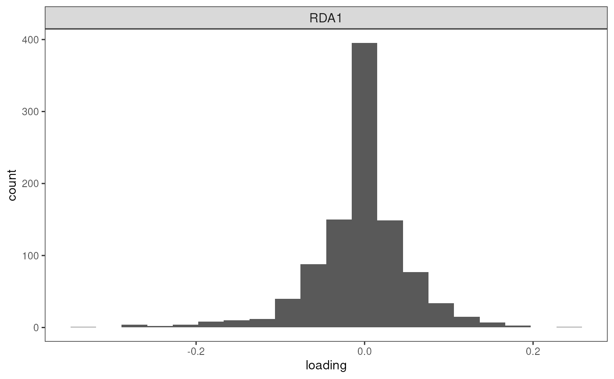

# RDA

## Redundancy analysis (RDA)

``` r

library(algatr)
```

``` r

#Install required packages
rda_packages()
```

``` r

library(dplyr)
library(raster)
library(vegan)
```

**If using RDA, please cite the following: Capblancq T., Forester B.R.
(2021) Redundancy analysis: A Swiss Army Knife for landscape genomics.
Methods in Ecology and Evolution 12:2298-2309.
<DOI:10.1111/2041-210X.13722>**

Redundancy analysis (RDA) is a genotype-environment association (GEA)
method that uses constrained ordination to detect outlier loci that are
significantly associated with environmental variables. It does so by
combining regression (in which response variables are genetic data, in
our case, while explanatory variables are environmental data) with
ordination (a PCA). Importantly, RDA is multivariate (i.e., multiple
loci can be considered at a time), which is appealing in cases where
multilocus selection may be occurring.

Model selection is performed by starting with a null model wherein the
response is only explained by an intercept, and environmental variables
are added until the amount of variance explained by a model that
includes all variables is reached. By doing so, this method minimizes
the *redundancy* among explanatory variables. Importantly, we can also
perform an RDA that accounts for *covariables* (or “conditioning
variables”) such as those that account for neutral population structure.
When covariables are included, this is called a **partial RDA**. In
algatr, population structure is quantified by running a PCA on the
genetic data, and selecting a number of PC axes to best represent this
type of neutral variation.

Some of the earliest examples of uses of RDA for identifying
environment-associated loci are [Lasky et
al. 2012](https://onlinelibrary.wiley.com/doi/10.1111/j.1365-294X.2012.05709.x)
and [Forester et
al. 2016](https://onlinelibrary.wiley.com/doi/10.1111/mec.13476). Since
then, there have been several reviews and walkthroughs of the method
that provide additional information, including workflows and comparisons
with other GEA methods (e.g., [Forester et
al. 2018](https://onlinelibrary.wiley.com/doi/full/10.1111/mec.14584)).
Much of algatr’s code is adapted from one such paper, [Capblancq &
Forester
2021](https://besjournals.onlinelibrary.wiley.com/doi/10.1111/2041-210X.13722),
the code of which is available
[here](https://github.com/Capblancq/RDA-landscape-genomics). algatr’s
general workflow roughly follows the framework of Capblancq & Forester
(2021).

RDA cannot take in missing values. Imputation based on the per-site
median is commonly performed, but there are several other ways
researchers can deal with missing values. For example, algatr contains
the
[`str_impute()`](https://thewanglab.github.io/algatr/reference/str_impute.md)
function to impute missing values based on population structure using
the [`LEA::impute()`](https://rdrr.io/pkg/LEA/man/impute.html) function.
However, here, we’ll opt to impute to the median, but strongly urge
researchers to use extreme caution when using this form of simplistic
imputation. We mainly provide code to impute on the median for testing
datasets and highly discourage its use in further analyses (please use
[`str_impute()`](https://thewanglab.github.io/algatr/reference/str_impute.md)
instead!).

The general workflow to perform an RDA with algatr is as follows:

- **Simple vs. partial RDAs:** We can run a simple RDA (no covariables)
  or partial RDA (conditioning covariables included) using
  [`rda_run()`](https://thewanglab.github.io/algatr/reference/rda_run.md)

- **Variable selection:** Both simple and partial RDAs can be performed
  considering all variables (`"full"` model) or by performing variable
  selection to determine variables that contribute most to genetic
  variance (`"best"` model)

- **Variance partitioning:** We can perform variance partitioning
  considering only variables that contribute significantly to genetic
  variance using
  [`rda_varpart()`](https://thewanglab.github.io/algatr/reference/rda_varpart.md)

- **Detecting outlier loci:** Based on the results from above, we can
  detect outlier loci with
  [`rda_getoutliers()`](https://thewanglab.github.io/algatr/reference/rda_getoutliers.md)

#### Read in and process genetic data

Running an RDA requires two data files for input: a genotype dosage
matrix (the `gen` argument) and the environmental values extracted at
sampling coordinates (the `env` argument). Let’s first convert our vcf
to a dosage matrix using the
[`vcf_to_dosage()`](https://thewanglab.github.io/algatr/reference/vcf_to_dosage.md)
function. *N.B.: our code assumes that sample IDs from our genetic data
and our coords are in the same order; be sure to check this before
moving forward!*

``` r

load_algatr_example()
#> 
#> ---------------- example dataset ----------------
#>  
#> Objects loaded: 
#> *liz_vcf* vcfR object (1000 loci x 53 samples) 
#> *liz_gendist* genetic distance matrix (Plink Distance) 
#> *liz_coords* dataframe with x and y coordinates 
#> *CA_env* RasterStack with example environmental layers 
#> 
#> -------------------------------------------------
#> 
#> 
# Convert from vcf to dosage matrix:
gen <- vcf_to_dosage(liz_vcf)
#> Loading required namespace: vcfR
#> Loading required namespace: adegenet
```

As mentioned above, running an RDA requires that your genotype matrix
contains no missing values. Let’s impute missing values based on the
per-site median. *N.B.: this type of simplistic imputation is strongly
not recommended for downstream analyses and is used here for example’s
sake!*

``` r

# Are there NAs in the data?
gen[1:5, 1:5]
#>        Locus_10 Locus_15 Locus_22 Locus_28 Locus_32
#> ALT3          0        0        0        0        0
#> BAR360        0        0        0       NA        0
#> BLL5          0       NA        0        0       NA
#> BNT5          0        0       NA       NA        0
#> BOF1          0       NA       NA       NA       NA
gen <- simple_impute(gen)
# Check that NAs are gone
gen[1:5, 1:5]
#>        Locus_10 Locus_15 Locus_22 Locus_28 Locus_32
#> ALT3          0        0        0        0        0
#> BAR360        0        0        0        0        0
#> BLL5          0        0        0        0        0
#> BNT5          0        0        0        0        0
#> BOF1          0        0        0        0        0
```

#### Process environmental data

Let’s extract environmental variables using the
[`extract()`](https://rspatial.github.io/terra/reference/extract.html)
function from the raster package. We also need to standardize
environmental variables. This is particularly important if we are using
(for example) bioclimatic variables as input, as units of measurement
are completely different (e.g., mm for precipitation vs. degrees Celsius
for temperature). To do so, we’ll use the
[`scale()`](https://rdrr.io/r/base/scale.html) function within the
raster package.

``` r

# Extract environmental vars
env <- raster::extract(CA_env, liz_coords)

# Standardize environmental variables and make into dataframe
env <- scale(env, center = TRUE, scale = TRUE)
env <- data.frame(env)
```

### Running simple and partial RDAs using `rda_run()`, with and without variable selection

------------------------------------------------------------------------

The main function within algatr to perform an RDA is
[`rda_run()`](https://thewanglab.github.io/algatr/reference/rda_run.md),
which uses the
[`rda()`](https://vegandevs.github.io/vegan/reference/cca.html) function
within the vegan package.

#### Run a simple RDA with no variable selection

A simple RDA is one in which our model will not account for covariables
in the model, and is the default for
[`rda_run()`](https://thewanglab.github.io/algatr/reference/rda_run.md).
Let’s first run a simple RDA on all environmental variables (i.e., no
variable selection). This is specified using the `model = "full"`
argument.

``` r

mod_full <- rda_run(gen, env, model = "full")
```

The resulting object is large, containing 12 elements relevant to the
RDA. Let’s take a look at what function was called. We can see that all
environmental variables (CA_rPCA1, 2, and 3) were included in the model,
and that geography or structure were not included in the model (and
there were no conditioning variables).

``` r

mod_full$call
#> rda(formula = gen ~ CA_rPCA1 + CA_rPCA2 + CA_rPCA3, data = moddf)
```

Now, let’s take a look at the summary of this model. One of the most
important parts of this object is the partitioning of variance. Within
an RDA, the term “inertia” can be interpreted as variance, and our
results show us that the amount of variance explained by explanatory
variables alone (constrained inertia) is only 9.768%. Unconstrained
inertia is the residual variance, which is very high (90.232%). The
summary also provides site scores, site constraints, and biplot scores.

``` r

summary(mod_full)
#> 
#> Call:
#> rda(formula = gen ~ CA_rPCA1 + CA_rPCA2 + CA_rPCA3, data = moddf) 
#> 
#> Partitioning of variance:
#>               Inertia Proportion
#> Total          143.39    1.00000
#> Constrained     14.01    0.09768
#> Unconstrained  129.38    0.90232
#> 
#> Eigenvalues, and their contribution to the variance 
#> 
#> Importance of components:
#>                          RDA1    RDA2    RDA3     PC1     PC2     PC3     PC4
#> Eigenvalue            7.28806 4.98205 1.73568 18.6608 9.31326 7.51572 5.53312
#> Proportion Explained  0.05083 0.03474 0.01210  0.1301 0.06495 0.05241 0.03859
#> Cumulative Proportion 0.05083 0.08557 0.09768  0.2278 0.29277 0.34518 0.38377
#>                           PC5    PC6     PC7     PC8     PC9    PC10    PC11
#> Eigenvalue            4.51893 4.0443 3.69111 3.30413 3.09940 3.04539 3.00412
#> Proportion Explained  0.03152 0.0282 0.02574 0.02304 0.02162 0.02124 0.02095
#> Cumulative Proportion 0.41529 0.4435 0.46923 0.49228 0.51389 0.53513 0.55608
#>                          PC12    PC13    PC14    PC15    PC16   PC17    PC18
#> Eigenvalue            2.83164 2.80969 2.74342 2.58682 2.47393 2.4664 2.32471
#> Proportion Explained  0.01975 0.01959 0.01913 0.01804 0.01725 0.0172 0.01621
#> Cumulative Proportion 0.57583 0.59542 0.61456 0.63260 0.64985 0.6671 0.68326
#>                          PC19    PC20    PC21    PC22    PC23    PC24    PC25
#> Eigenvalue            2.29159 2.22955 2.15249 2.10481 2.01172 1.94388 1.90538
#> Proportion Explained  0.01598 0.01555 0.01501 0.01468 0.01403 0.01356 0.01329
#> Cumulative Proportion 0.69925 0.71480 0.72981 0.74449 0.75852 0.77207 0.78536
#>                          PC26    PC27    PC28    PC29    PC30    PC31    PC32
#> Eigenvalue            1.82439 1.79687 1.68505 1.64293 1.59963 1.56602 1.50690
#> Proportion Explained  0.01272 0.01253 0.01175 0.01146 0.01116 0.01092 0.01051
#> Cumulative Proportion 0.79808 0.81062 0.82237 0.83382 0.84498 0.85590 0.86641
#>                          PC33     PC34    PC35     PC36    PC37     PC38
#> Eigenvalue            1.46174 1.433419 1.34638 1.331355 1.28477 1.253763
#> Proportion Explained  0.01019 0.009997 0.00939 0.009285 0.00896 0.008744
#> Cumulative Proportion 0.87661 0.886602 0.89599 0.905277 0.91424 0.922981
#>                          PC39     PC40    PC41     PC42     PC43     PC44
#> Eigenvalue            1.23738 1.175289 1.13416 1.072082 1.067608 1.017457
#> Proportion Explained  0.00863 0.008197 0.00791 0.007477 0.007446 0.007096
#> Cumulative Proportion 0.93161 0.939807 0.94772 0.955193 0.962639 0.969734
#>                           PC45     PC46     PC47     PC48     PC49
#> Eigenvalue            0.998927 0.910062 0.866439 0.836444 0.727872
#> Proportion Explained  0.006967 0.006347 0.006043 0.005833 0.005076
#> Cumulative Proportion 0.976701 0.983048 0.989090 0.994924 1.000000
#> 
#> Accumulated constrained eigenvalues
#> Importance of components:
#>                         RDA1   RDA2   RDA3
#> Eigenvalue            7.2881 4.9820 1.7357
#> Proportion Explained  0.5204 0.3557 0.1239
#> Cumulative Proportion 0.5204 0.8761 1.0000
```

One of the most relevant statistics to present from an RDA model is the
adjusted R2 value. The R2 value *must* be adjusted; if not, it is biased
because it will always increase if independent variables are added
(i.e., there is no penalization for adding independent variables that
aren’t significantly affecting dependent variables within the model).
The adjusted R2 value from the full (global) model can also help us
determine the stopping point when we go on to do variable selection. As
we can see, the unadjusted R2 is 0.098, while the adjusted value is
0.042. Be sure to always report *adjusted* R2 values.

``` r

RsquareAdj(mod_full)
#> $r.squared
#> [1] 0.0976769
#> 
#> $adj.r.squared
#> [1] 0.04243263
```

#### Run a simple RDA with variable selection

Now, let’s run an RDA model with variable selection by specifying the
`"best"` model within
[`rda_run()`](https://thewanglab.github.io/algatr/reference/rda_run.md).
Variable selection occurs using the
[`ordiR2step()`](https://vegandevs.github.io/vegan/reference/ordistep.html)
function in the vegan package, and is a forward selection method that
begins with a null model and adds explanatory variables one at a time
until genetic variance is maximized. To perform forward selection, we
need to specify stopping criteria (i.e., when to stop adding more
explanatory variables). There are two primary ways to specify stopping
criteria: parameters involved in a permutation-based significance test
(two parameters: the limits of permutation p-values for adding (`Pin`)
or dropping (`Pout`) a term to the model, and the number of permutations
used in the estimation of adjusted R2 (`R2permutations`)), and whether
to use the adjusted R2 value as the stopping criterion (`R2scope`; only
models with adjusted R2 values lower than specified are accepted).

``` r

mod_best <- rda_run(gen, env,
  model = "best",
  Pin = 0.05,
  R2permutations = 1000,
  R2scope = T
)
#> Step: R2.adj= 0 
#> Call: gen ~ 1 
#>  
#>                  R2.adjusted
#> <All variables> 0.0424326339
#> + CA_rPCA2      0.0196214014
#> + CA_rPCA3      0.0137427906
#> + CA_rPCA1      0.0009953656
#> <model>         0.0000000000
#> 
#>            Df    AIC      F Pr(>F)   
#> + CA_rPCA2  1 264.09 2.0407  0.002 **
#> ---
#> Signif. codes:  0 '***' 0.001 '**' 0.01 '*' 0.05 '.' 0.1 ' ' 1
#> 
#> Step: R2.adj= 0.0196214 
#> Call: gen ~ CA_rPCA2 
#>  
#>                 R2.adjusted
#> <All variables>  0.04243263
#> + CA_rPCA3       0.03919420
#> + CA_rPCA1       0.01991617
#> <model>          0.01962140
#> 
#>            Df    AIC      F Pr(>F)   
#> + CA_rPCA3  1 263.97 2.0389  0.006 **
#> ---
#> Signif. codes:  0 '***' 0.001 '**' 0.01 '*' 0.05 '.' 0.1 ' ' 1
#> 
#> Step: R2.adj= 0.0391942 
#> Call: gen ~ CA_rPCA2 + CA_rPCA3 
#>  
#>                 R2.adjusted
#> <All variables>  0.04243263
#> + CA_rPCA1       0.04243263
#> <model>          0.03919420
#> 
#>            Df    AIC      F Pr(>F)
#> + CA_rPCA1  1 264.72 1.1691   0.17
```

Let’s look at our best model, and see how it compares to our full model.
There is also an additional element in the `mod_best` object, which are
the results from an ANOVA-like permutation test. When we look at the
call, we can now see that only environmental PCs 2 and 3 are considered
in the model, meaning that PC1 is not considered to be significantly
associated with genetic variance. Importantly, our adjusted R2 value is
0.039 (compared to 0.042 for the full model), which tells us that the
model with only two of the environmental variables explains nearly as
much as the RDA with all three.

``` r

mod_best$call
#> rda(formula = gen ~ CA_rPCA2 + CA_rPCA3, data = list(CA_rPCA1 = c(-0.522839974379508, 
#> -0.762922496792446, -1.86447664460538, -0.55855495052221, -0.57269132662902, 
#> -0.859038227685075, -0.072043636015037, -1.13434251082331, 0.213097754647621, 
#> 1.17658258339642, 0.297967827057378, -0.464084951296452, 0.855636561890484, 
#> 0.0953591037247294, -0.539120600258253, -0.539120600258253, 2.02106276091047, 
#> 2.60771978346453, 1.05200372725675, -0.629034085084968, -2.46854442016198, 
#> 0.0260725501626235, 0.0260725501626235, -0.746727041242616, -0.746727041242616, 
#> 1.47817418774494, -0.936256358142168, 0.237069667112143, 0.237069667112143, 
#> -2.50772800868535, 1.1549776008528, 1.1549776008528, 1.35110535969113, 
#> -0.0561341328070219, -0.373693242601386, -0.373693242601386, 
#> 0.399649342383328, -0.519583011248178, -0.519583011248178, -0.00782108370036044, 
#> -0.00782108370036044, 1.31832335901042, -0.576916652177962, -0.576916652177962, 
#> -0.431388317340501, 1.01567982581473, 1.01567982581473, -0.774971381524837, 
#> 0.0255686311719819, 0.0255686311719819, 1.23221556728965, 0.562570108128171, 
#> 0.562570108128171), CA_rPCA2 = c(-1.73421968589969, -0.495566879281243, 
#> 1.51131736830612, -1.67493255235748, -0.123708413803996, 1.50348370296656, 
#> 0.497816234346518, -0.0361828529216023, 1.45881385953799, 1.05507640816238, 
#> 1.16578925063956, -0.171884322138841, -1.48147701298751, 0.73732782244215, 
#> -0.24074966665597, -0.24074966665597, 0.0399288951693412, -0.0168067684167015, 
#> 1.50893728869516, -1.66080206726807, -1.26905097514619, -1.58120699373763, 
#> -1.58120699373763, -0.318166617922595, -0.318166617922595, 0.180021614507387, 
#> -0.0989825979307121, -0.816171384725929, -0.816171384725929, 
#> -1.07421654041962, 0.421584519953747, 0.421584519953747, 0.118248661677072, 
#> 0.574145244972511, -1.3512331198936, -1.3512331198936, 1.75926629328248, 
#> 1.0258059259489, 1.0258059259489, -0.436435405832552, -0.436435405832552, 
#> 0.225239240818199, -0.306788498922838, -0.306788498922838, -0.0148935881217706, 
#> 0.167555482577237, 0.167555482577237, 1.53563948346279, -0.0452634761317479, 
#> -0.0452634761317479, -0.608661189332775, 1.77623627386297, 1.77623627386297
#> ), CA_rPCA3 = c(-0.171546498077063, 0.304720882227611, -0.746263624095161, 
#> -0.652007967024141, 1.21800886957269, -1.12087856243146, -0.0660703381728475, 
#> 1.19845138122507, -2.64925798891154, 0.00947773794228616, -1.44942908084647, 
#> 1.08487356159833, -0.149185156402174, 1.50244347942537, 2.13591256195157, 
#> 2.13591256195157, 0.263989245701077, 0.527413437472692, -1.87246014428684, 
#> -0.874873913836537, -0.467712504092297, 0.0665799769739865, 0.0665799769739865, 
#> 0.0384364183523902, 0.0384364183523902, 0.0320667279913713, -0.0354734132813299, 
#> -0.233862027212001, -0.233862027212001, -0.817475641342106, -0.0125888642166748, 
#> -0.0125888642166748, 0.0520076559082537, -0.559760860443754, 
#> -0.540788236051066, -0.540788236051066, -1.79928400205617, -0.331431611440013, 
#> -0.331431611440013, 0.230740506231628, 0.230740506231628, 0.709448526300272, 
#> 0.943896504682603, 0.943896504682603, 1.33634384148885, 1.23383642686616, 
#> 1.23383642686616, 0.0143927948732277, 0.714359011285843, 0.714359011285843, 
#> 0.339745387114261, -1.82594258419516, -1.82594258419516)))
mod_best$anova
#>                   R2.adj Df    AIC      F Pr(>F)   
#> + CA_rPCA2      0.019621  1 264.09 2.0407  0.002 **
#> + CA_rPCA3      0.039194  1 263.97 2.0389  0.006 **
#> <All variables> 0.042433                           
#> ---
#> Signif. codes:  0 '***' 0.001 '**' 0.01 '*' 0.05 '.' 0.1 ' ' 1
RsquareAdj(mod_best)
#> $r.squared
#> [1] 0.07614827
#> 
#> $adj.r.squared
#> [1] 0.0391942
```

Following variable selection, we want to retain two environmental
variables (CA_rPCA2 and CA_rPCA3) for all subsequent analyses.

#### Run a partial RDA with geography as a covariable

A partial RDA, as described at the beginning of the vignette, is when
covariables (or conditioning variables) are incorporated into the RDA.
Within
[`rda_run()`](https://thewanglab.github.io/algatr/reference/rda_run.md),
to correct for geography, users can set `correctGEO = TRUE`, in which
case sampling coordinates (`coords`) must also be provided. Let’s now
run a partial RDA, without any variable selection (the full model) and
view the results.

``` r

mod_pRDA_geo <- rda_run(gen, env, liz_coords,
  model = "full",
  correctGEO = TRUE,
  correctPC = FALSE
)
```

Let’s take a look at our partial RDA results. Note that now, the call
includes conditioning variables x and y, which correspond to our
latitude and longitude values. Conditioning variables are specified
within the
[`rda()`](https://vegandevs.github.io/vegan/reference/cca.html) function
using the `Condition()` function. Finally, when we look at the summary
of the resulting object, we can see that along with total, constrained,
and unconstrained inertia (or variance) as with our simple RDA, there is
an additional row for conditioned inertia because our partial RDA
includes conditioning variables. Interestingly, the conditioned inertia
is higher than constrained inertia, suggesting that geography is more
associated with genetic variance than our environmental variables are.

``` r

anova(mod_pRDA_geo)
#> Permutation test for rda under reduced model
#> Permutation: free
#> Number of permutations: 999
#> 
#> Model: rda(formula = gen ~ CA_rPCA1 + CA_rPCA2 + CA_rPCA3 + Condition(x + y), data = moddf)
#>          Df Variance      F Pr(>F)    
#> Model     3   11.306 1.5948  0.001 ***
#> Residual 47  111.068                  
#> ---
#> Signif. codes:  0 '***' 0.001 '**' 0.01 '*' 0.05 '.' 0.1 ' ' 1
RsquareAdj(mod_pRDA_geo) # 0.0305
#> $r.squared
#> [1] 0.07884828
#> 
#> $adj.r.squared
#> [1] 0.03058243
summary(mod_pRDA_geo)
#> 
#> Call:
#> rda(formula = gen ~ CA_rPCA1 + CA_rPCA2 + CA_rPCA3 + Condition(x +      y), data = moddf) 
#> 
#> Partitioning of variance:
#>               Inertia Proportion
#> Total          143.39    1.00000
#> Conditioned     21.01    0.14656
#> Constrained     11.31    0.07885
#> Unconstrained  111.07    0.77459
#> 
#> Eigenvalues, and their contribution to the variance 
#> after removing the contribution of conditiniong variables
#> 
#> Importance of components:
#>                          RDA1    RDA2    RDA3      PC1     PC2     PC3     PC4
#> Eigenvalue            6.87372 2.80216 1.63009 11.00385 7.49907 5.16346 4.68171
#> Proportion Explained  0.05617 0.02290 0.01332  0.08992 0.06128 0.04219 0.03826
#> Cumulative Proportion 0.05617 0.07907 0.09239  0.18231 0.24359 0.28578 0.32404
#>                           PC5     PC6     PC7     PC8     PC9    PC10    PC11
#> Eigenvalue            4.21148 3.72312 3.45801 3.19495 3.01860 2.98188 2.93280
#> Proportion Explained  0.03441 0.03042 0.02826 0.02611 0.02467 0.02437 0.02397
#> Cumulative Proportion 0.35845 0.38888 0.41714 0.44324 0.46791 0.49228 0.51624
#>                          PC12    PC13   PC14    PC15    PC16    PC17    PC18
#> Eigenvalue            2.79673 2.59175 2.5826 2.49887 2.45425 2.32321 2.29777
#> Proportion Explained  0.02285 0.02118 0.0211 0.02042 0.02006 0.01898 0.01878
#> Cumulative Proportion 0.53910 0.56028 0.5814 0.60180 0.62186 0.64084 0.65962
#>                          PC19    PC20    PC21    PC22    PC23   PC24    PC25
#> Eigenvalue            2.15916 2.14664 2.03834 2.00771 1.91618 1.8479 1.80441
#> Proportion Explained  0.01764 0.01754 0.01666 0.01641 0.01566 0.0151 0.01475
#> Cumulative Proportion 0.67726 0.69480 0.71146 0.72787 0.74352 0.7586 0.77337
#>                         PC26    PC27    PC28    PC29    PC30    PC31    PC32
#> Eigenvalue            1.7740 1.68265 1.64600 1.58626 1.52630 1.47782 1.45805
#> Proportion Explained  0.0145 0.01375 0.01345 0.01296 0.01247 0.01208 0.01191
#> Cumulative Proportion 0.7879 0.80162 0.81507 0.82803 0.84050 0.85258 0.86449
#>                          PC33    PC34    PC35    PC36    PC37     PC38     PC39
#> Eigenvalue            1.42866 1.37519 1.30318 1.27465 1.24443 1.221578 1.169694
#> Proportion Explained  0.01167 0.01124 0.01065 0.01042 0.01017 0.009982 0.009558
#> Cumulative Proportion 0.87617 0.88741 0.89805 0.90847 0.91864 0.928622 0.938181
#>                           PC40     PC41     PC42     PC43     PC44     PC45
#> Eigenvalue            1.073702 1.068009 1.045150 1.006285 0.935246 0.866846
#> Proportion Explained  0.008774 0.008727 0.008541 0.008223 0.007643 0.007084
#> Cumulative Proportion 0.946955 0.955682 0.964223 0.972446 0.980088 0.987172
#>                           PC46     PC47
#> Eigenvalue            0.841414 0.728431
#> Proportion Explained  0.006876 0.005952
#> Cumulative Proportion 0.994048 1.000000
#> 
#> Accumulated constrained eigenvalues
#> Importance of components:
#>                        RDA1   RDA2   RDA3
#> Eigenvalue            6.874 2.8022 1.6301
#> Proportion Explained  0.608 0.2478 0.1442
#> Cumulative Proportion 0.608 0.8558 1.0000
```

#### Run a partial RDA with population genetic structure and geography as covariables

Lastly, let’s run a partial RDA with both geography
(`correctGEO = TRUE`) and population structure (`correctPC = TRUE`) as
conditioning variables. Within algatr, population structure is
quantified using a PCA, and a user can specify the number of axes to
retain in the RDA model. In this case, we’ll retain three axes, which we
can specify using the `nPC` argument. If this argument is set to
`"manual"`, a screeplot will be printed and a user can manually enter
the number of PCs that they feel best describe the data.

``` r

mod_pRDA_gs <- rda_run(gen, env, liz_coords,
  model = "full",
  correctGEO = TRUE,
  correctPC = TRUE,
  nPC = 3
)
```


Now, we see that even more inertia/variance is explained by the
conditioning variables.

``` r

summary(mod_pRDA_gs)
#> 
#> Call:
#> rda(formula = gen ~ CA_rPCA1 + CA_rPCA2 + CA_rPCA3 + Condition(PC1 +      PC2 + PC3 + x + y), data = moddf) 
#> 
#> Partitioning of variance:
#>               Inertia Proportion
#> Total         143.389    1.00000
#> Conditioned    48.063    0.33519
#> Constrained     6.672    0.04653
#> Unconstrained  88.654    0.61828
#> 
#> Eigenvalues, and their contribution to the variance 
#> after removing the contribution of conditiniong variables
#> 
#> Importance of components:
#>                          RDA1    RDA2    RDA3     PC1     PC2     PC3     PC4
#> Eigenvalue            2.72234 2.30006 1.64942 5.15035 4.44551 3.82383 3.55107
#> Proportion Explained  0.02856 0.02413 0.01730 0.05403 0.04663 0.04011 0.03725
#> Cumulative Proportion 0.02856 0.05269 0.06999 0.12402 0.17065 0.21077 0.24802
#>                           PC5     PC6     PC7     PC8     PC9    PC10    PC11
#> Eigenvalue            3.24764 3.02810 2.99645 2.95013 2.79913 2.65085 2.59129
#> Proportion Explained  0.03407 0.03177 0.03143 0.03095 0.02936 0.02781 0.02718
#> Cumulative Proportion 0.28209 0.31385 0.34529 0.37623 0.40560 0.43341 0.46059
#>                          PC12    PC13    PC14    PC15    PC16    PC17    PC18
#> Eigenvalue            2.52112 2.46520 2.34331 2.30029 2.16258 2.15304 2.05042
#> Proportion Explained  0.02645 0.02586 0.02458 0.02413 0.02269 0.02259 0.02151
#> Cumulative Proportion 0.48704 0.51290 0.53748 0.56161 0.58430 0.60688 0.62839
#>                          PC19    PC20    PC21   PC22    PC23    PC24    PC25
#> Eigenvalue            2.01366 1.92134 1.85435 1.8112 1.79300 1.68266 1.65184
#> Proportion Explained  0.02112 0.02016 0.01945 0.0190 0.01881 0.01765 0.01733
#> Cumulative Proportion 0.64952 0.66967 0.68912 0.7081 0.72693 0.74458 0.76191
#>                          PC26    PC27    PC28    PC29    PC30    PC31    PC32
#> Eigenvalue            1.58977 1.52980 1.47897 1.46048 1.44680 1.38037 1.30440
#> Proportion Explained  0.01668 0.01605 0.01551 0.01532 0.01518 0.01448 0.01368
#> Cumulative Proportion 0.77859 0.79464 0.81015 0.82547 0.84065 0.85513 0.86882
#>                          PC33    PC34    PC35    PC36    PC37    PC38    PC39
#> Eigenvalue            1.27639 1.24668 1.22365 1.17070 1.07515 1.06819 1.05602
#> Proportion Explained  0.01339 0.01308 0.01284 0.01228 0.01128 0.01121 0.01108
#> Cumulative Proportion 0.88221 0.89528 0.90812 0.92040 0.93168 0.94289 0.95396
#>                          PC40     PC41    PC42     PC43     PC44
#> Eigenvalue            1.00764 0.940164 0.86839 0.842461 0.729857
#> Proportion Explained  0.01057 0.009863 0.00911 0.008838 0.007656
#> Cumulative Proportion 0.96453 0.974396 0.98351 0.992344 1.000000
#> 
#> Accumulated constrained eigenvalues
#> Importance of components:
#>                        RDA1   RDA2   RDA3
#> Eigenvalue            2.722 2.3001 1.6494
#> Proportion Explained  0.408 0.3447 0.2472
#> Cumulative Proportion 0.408 0.7528 1.0000
```

### Variance partitioning with partial RDA

------------------------------------------------------------------------

In many cases, we want to understand the independent contributions of
each explanatory variable in combination with our covariables. Also, we
can understand how much confounded variance there is (i.e., variation
that is explained by the combination of multiple explanatory variables).
The best way to do this is to run partial RDAs on each set of
explanatory variables and examine the inertia of each pRDA result as it
compares to the full model. In this case, the full model is an RDA that
considers neutral processes as explanatory variables rather than
conditioning variables (covariables).

The call for this full model looks like this:
`rda(gen ~ env + covariable, data)`, rather than a true partial RDA
which would take the form:
`rda(gen ~ env + Condition(covariable), data)`.

In algatr, we can run variance partitioning using the function
[`rda_varpart()`](https://thewanglab.github.io/algatr/reference/rda_varpart.md),
which will run the full model (as above) and then will run successive
pRDAs which are conditioned on three successive sets of variables. These
variable sets are significant environmental variables (in our case,
environmental PCs 2 and 3), population genetic structure (once again
determined using a PC with a user-specified number of PC axes), and
geography (sampling coordinates). This function will then provide us
with information on how variance is partitioned in the form of a table
containing relevant statistics; this table is nearly identical to Table
2 from [Capblancq & Forester
2021](https://besjournals.onlinelibrary.wiley.com/doi/10.1111/2041-210X.13722).
The
[`rda_varpart()`](https://thewanglab.github.io/algatr/reference/rda_varpart.md)
parameters are identical to those from
[`rda_run()`](https://thewanglab.github.io/algatr/reference/rda_run.md).
As with
[`rda_run()`](https://thewanglab.github.io/algatr/reference/rda_run.md),
we can provide a number for the number of PCs to consider for population
structure (`nPC`), or this argument can be set to `"manual"` if a user
would like to manually enter a number into the console after viewing the
screeplot. We can then use
[`rda_varpart_table()`](https://thewanglab.github.io/algatr/reference/rda_varpart_table.md)
to visualize these results in an aesthetically pleasing way; users can
specify whether to display the function call in the table (`call_col`;
defaults to `FALSE`) and the number of digits to round to `digits` (the
default is 2).

``` r

varpart <- rda_varpart(gen, env, liz_coords,
  Pin = 0.05, R2permutations = 1000,
  R2scope = T, nPC = 3
)
#> Step: R2.adj= 0 
#> Call: gen ~ 1 
#>  
#>                  R2.adjusted
#> <All variables> 0.0424326339
#> + CA_rPCA2      0.0196214014
#> + CA_rPCA3      0.0137427906
#> + CA_rPCA1      0.0009953656
#> <model>         0.0000000000
#> 
#>            Df    AIC      F Pr(>F)   
#> + CA_rPCA2  1 264.09 2.0407  0.004 **
#> ---
#> Signif. codes:  0 '***' 0.001 '**' 0.01 '*' 0.05 '.' 0.1 ' ' 1
#> 
#> Step: R2.adj= 0.0196214 
#> Call: gen ~ CA_rPCA2 
#>  
#>                 R2.adjusted
#> <All variables>  0.04243263
#> + CA_rPCA3       0.03919420
#> + CA_rPCA1       0.01991617
#> <model>          0.01962140
#> 
#>            Df    AIC      F Pr(>F)   
#> + CA_rPCA3  1 263.97 2.0389  0.006 **
#> ---
#> Signif. codes:  0 '***' 0.001 '**' 0.01 '*' 0.05 '.' 0.1 ' ' 1
#> 
#> Step: R2.adj= 0.0391942 
#> Call: gen ~ CA_rPCA2 + CA_rPCA3 
#>  
#>                 R2.adjusted
#> <All variables>  0.04243263
#> + CA_rPCA1       0.04243263
#> <model>          0.03919420
#> 
#>            Df    AIC      F Pr(>F)
#> + CA_rPCA1  1 264.72 1.1691  0.164
```


``` r

rda_varpart_table(varpart, call_col = TRUE)
```

[TABLE]

From the above table, we can see that the full model only explains 27%
of the total variance in our genetic data. Furthermore, our pure
environmental model explains only a small proportion of the variance
(“inertia”) contained within the full model (9%), and that population
structure explains substantially more (44%). There is also a large
amount of variance (37%) within the full model that is confounded,
meaning that variables within the three variable sets explain a
substantial amount of the full model’s variance *when in combination
with one another*. This is a relatively common occurrence (see Capblancq
& Forester 2021), and users should always keep in mind how collinearity
may affect their results (and account for this, if possible; see
algatr’s environmental data vignette for more information on how to do
so). However, accounting for collinearity may also elevate false
positive rates, while failing to account for it at all can lead to
elevated false negative rates.

In our case, it is clear from our variance partitioning analysis that
much of the variation in our genetic data can explained by population
structure, and thus users may want to further explore more sophisticated
approaches for quantifying demographic history or population structure
before moving forward with outlier loci detection. As with most
analyses, careful consideration of the input data and the biology of the
system are critical to draw robust and reliable conclusions.

### Identifying candidate SNPs with `rda_getoutliers()`

------------------------------------------------------------------------

Having run variance partitioning on our data, we can now move forward
with detecting outlier loci that are significantly associated with
environmental variables. To do so, we’ll first run a partial RDA on only
those significant environmental variables, and we’ll also want to add
population structure as a covariable (i.e., a conditioning variable).
We’ll only retain two PC axes for our measurement of population
structure.

``` r

mod_pRDA <- rda_run(gen, env, model = "best", correctPC = TRUE, nPC = 2)
```


    #> Step: R2.adj= 0 
    #> Call: gen ~ 1 
    #>  
    #>                         R2.adjusted
    #> <All variables>        0.0202527037
    #> + CA_rPCA2             0.0196214014
    #> + CA_rPCA3             0.0137427906
    #> + CA_rPCA1             0.0009953656
    #> <model>                0.0000000000
    #> + Condition(PC1 + PC2) 0.0000000000
    #> 
    #>            Df    AIC      F Pr(>F)   
    #> + CA_rPCA2  1 264.09 2.0407  0.004 **
    #> ---
    #> Signif. codes:  0 '***' 0.001 '**' 0.01 '*' 0.05 '.' 0.1 ' ' 1
    #> 
    #> Step: R2.adj= 0.0196214 
    #> Call: gen ~ CA_rPCA2 
    #>  
    #>                        R2.adjusted
    #> + CA_rPCA3              0.03919420
    #> <All variables>         0.02025270
    #> + CA_rPCA1              0.01991617
    #> <model>                 0.01962140
    #> + Condition(PC1 + PC2)  0.01834925

Given this partial RDA, only environmental PC2 is considered
significant.

``` r

mod_pRDA$anova
#>                   R2.adj Df    AIC      F Pr(>F)   
#> + CA_rPCA2      0.019621  1 264.09 2.0407  0.004 **
#> <All variables> 0.020253                           
#> ---
#> Signif. codes:  0 '***' 0.001 '**' 0.01 '*' 0.05 '.' 0.1 ' ' 1
```

Now that we have the RDA model, we can discover SNPs that are outliers.
In algatr, this can be done using two different methods to detect
outlier loci, specified by the `outlier_method` argument. The first uses
Z-scores for outlier detection, and is from [Forester et
al. 2018](https://onlinelibrary.wiley.com/doi/abs/10.1111/mec.14584);
their code can be found
[here](https://popgen.nescent.org/2018-03-27_RDA_GEA.html). The other
method transforms RDA loadings into p-values, and was developed by
[Capblancq et
al. 2018](https://onlinelibrary.wiley.com/doi/abs/10.1111/1755-0998.12906)
and is further described in [Capblancq & Forester
2021](https://besjournals.onlinelibrary.wiley.com/doi/10.1111/2041-210X.13722);
code developed to run this is associated with Capblancq and Forester
2021 and can be found
[here](https://github.com/Capblancq/RDA-landscape-genomics). We provide
brief explanations for each of these methods below.

**N.B.: Some researchers may prefer to do MAF filtering and linkage
disequilibrium pruning during outlier detection (e.g., Capblancq &
Forester 2021). In this case, only one SNP per contig is selected based
on the highest loading. The algatr pipeline does this filtering
initially when processing genetic data; see data processing vignette for
more information.**

#### Identifying outliers using the Z-scores method

To understand how the Z-scores method works to detect outliers, let’s
first take a look at the loadings of SNPs on the first two RDA axes
using the
[`rda_plot()`](https://thewanglab.github.io/algatr/reference/rda_plot.md)
function. This will show us histograms for each of the selected RDA
axes. SNPs that are not associated with environmental variables will
fall in the center of these distributions, with outliers falling at the
edges. The Z-score method works by setting a Z-score (number of standard
deviations) threshold beyond which SNPs will be considered outliers (see
[here](https://popgen.nescent.org/2018-03-27_RDA_GEA.html) for further
details).

If we set this value too stringently, we minimize our false positive
rate but risk detecting false negatives; if it’s set too high, we
increase our false positive rate. Researchers will want to adjust this
parameter based on their tolerance for detecting false positives, but
also the strength of selection under which outliers are subject to
(assuming that SNPs that are more significantly associated with
environmental variables are also under stronger selection).

Because only one environmental variable was associated with our genetic
data, we only have one resulting RDA axis.

``` r

rda_plot(mod_pRDA, axes = "all", binwidth = 20)
```



Now, let’s discover outliers with the
[`rda_getoutliers()`](https://thewanglab.github.io/algatr/reference/rda_getoutliers.md)
function. The method is specified using the `outlier_method` argument,
and the number of standard deviations to detect outliers is specified by
the `z` argument; it defaults to 3. The resulting object is a dataframe
containing the SNP name, the RDA axis it’s associated with, and the
loading along this axis. A screeplot for the RDA axes is automatically
generated (but can be switched off using the `plot` argument).

``` r

rda_sig_z <- rda_getoutliers(mod_pRDA, naxes = "all", outlier_method = "z", z = 3, plot = FALSE)

# How many outlier SNPs were detected?
length(rda_sig_z$rda_snps)
#> [1] 19
```

#### Identifying outliers using the p-value method

Another method to detect outliers is a p-value method wherein rather
than using the loadings along RDA axes to identify extreme outliers (as
with the Z-scores method above), the loadings are transformed into
p-values. To do so, Mahalanobis distances are calculated for each locus,
scaled based on a genomic inflation factor, from which p-values and
q-values can be computed. We then adjust our p-values (based on a false
discovery rate, for example; this adjustment is done using the
[`p.adjust()`](https://rdrr.io/r/stats/p.adjust.html) function) and
subsequently identify outliers based on a user-specified significance
threshold. Rather than detecting outliers based on a p-value
significance threshold, one could also detect outliers based on q-values
(which are also provided as output in algatr), as is done in [Capblancq
et
al. 2018](https://onlinelibrary.wiley.com/doi/abs/10.1111/1755-0998.12906)
and [Capblancq & Forester
2021](https://besjournals.onlinelibrary.wiley.com/doi/10.1111/2041-210X.13722).
To do so, we would select loci that fall below a user-specified
threshold based on the proportion of false positives we allow. For
example, if we allow 10% or fewer outliers to be false positives,
outliers could be identified based on loci that have q-values =\< 0.1.

Now, let’s detect outliers using this method. To do so, along with
`outlier_method`, we need to specify `p_adj`, which is the method by
which p-values are adjusted, as well as `sig`, which is our significance
threshold. We will also tell the function not to produce a screeplot.

One limitation of the p-value outlier method is that you cannot
calculate outliers given fewer than two RDA axes (as is the case with
our partial RDA results). So, let’s move forward with this outlier
detection method but using the results from our simple RDA model with
variable selection, `mod_best`.

``` r

rda_sig_p <- rda_getoutliers(mod_best, naxes = "all", outlier_method = "p", p_adj = "fdr", sig = 0.01, plot = FALSE)

# How many outlier SNPs were detected?
length(rda_sig_p$rda_snps)
#> [1] 101
```

As mentioned above, we could also identify outliers based on q-values.
To do so, we can extract the q-values from the resulting object from
[`rda_getoutliers()`](https://thewanglab.github.io/algatr/reference/rda_getoutliers.md).

``` r

# Identify outliers that have q-values < 0.1
q_sig <-
  rda_sig_p$rdadapt %>%
  # Make SNP names column from row names
  mutate(snp_names = row.names(.)) %>%
  filter(q.values <= 0.1)

# How many outlier SNPs were detected?
nrow(q_sig)
#> [1] 170
```

Note the differences between the two methods: using the p-value method,
we found many more outlier SNPs than with the Z-scores method (101
vs. 19). Even more outliers were found when only using q-values as a
significant threshold (170). We can also see that 19 SNPs were detected
using all three methods.

``` r

Reduce(intersect, list(
  q_sig$snp_names,
  rda_sig_p$rda_snps,
  rda_sig_z$rda_snps
))
#>  [1] "Locus_517"  "Locus_771"  "Locus_786"  "Locus_945"  "Locus_1247"
#>  [6] "Locus_1263" "Locus_1278" "Locus_1318" "Locus_1374" "Locus_1439"
#> [11] "Locus_1524" "Locus_1801" "Locus_1949" "Locus_2045" "Locus_2338"
#> [16] "Locus_2431" "Locus_2559" "Locus_2665" "Locus_2947"
```

### Visualizing RDA results with `rda_plot()`

------------------------------------------------------------------------

algatr provides options for visualizing RDA results in two ways with the
[`rda_plot()`](https://thewanglab.github.io/algatr/reference/rda_plot.md)
function: a biplot and a Manhattan plot.

#### RDA biplot

Let’s build a biplot (or some call it a triplot, since it also shows
loadings of environmental variables) with RDA axes 1 and 2, specified
using the `rdaplot` argument. In this case, we also need to specify the
number of axes to display using the `biplot_axes` argument. The default
of
[`rda_plot()`](https://thewanglab.github.io/algatr/reference/rda_plot.md)
is to plot all variables, regardless of whether they were considered
significant or not.

``` r

rda_plot(mod_best, rda_sig_p$rda_snps, biplot_axes = c(1, 2), rdaplot = TRUE, manhattan = FALSE)
#> Warning: Using `size` aesthetic for lines was deprecated in ggplot2 3.4.0.
#> ℹ Please use `linewidth` instead.
#> ℹ The deprecated feature was likely used in the algatr package.
#>   Please report the issue to the authors.
#> This warning is displayed once every 8 hours.
#> Call `lifecycle::last_lifecycle_warnings()` to see where this warning was
#> generated.
```


``` r


# In the case of our partial RDA, there was only one RDA axis, so a histogram is generated
rda_plot(mod_pRDA, rda_sig_z$rda_snps, rdaplot = TRUE, manhattan = FALSE, binwidth = 0.01)
```


#### Manhattan plot

Let’s now build a Manhattan plot with a significance level of 0.05 using
the `manhattan` argument; if this is set to TRUE, we must also provide a
significance threshold value using the `sig` argument (the default is
0.05). Be aware that outliers were detected with a different p-value
threshold which is why there are grey points above our threshold line
(i.e., data points are colorized according to the threshold of the
model, not the visualization).

``` r

rda_plot(mod_best, rda_sig_p$rda_snps, rda_sig_p$pvalues, rdaplot = FALSE, manhattan = TRUE)
```


### Interpreting RDA results

------------------------------------------------------------------------

As discussed in [Capblancq & Forester
2021](https://besjournals.onlinelibrary.wiley.com/doi/10.1111/2041-210X.13722),
users should be aware that ***“statistical selection of variables
optimizes variance explained but cannot, by itself, identify the
ecological or mechanistic drivers of genetic variation.”***

#### Identifying environmental associations with `rda_cor()` and `rda_table()`

Now that we’ve identified outlier loci, it is useful to be able to
identify how much they correlate to each environmental variable. To do
so, we can run a correlation test of each SNP using
[`rda_cor()`](https://thewanglab.github.io/algatr/reference/rda_cor.md)
and summarize results in a customizable table using
[`rda_table()`](https://thewanglab.github.io/algatr/reference/rda_table.md).

``` r

# Extract genotypes for outlier SNPs
rda_snps <- rda_sig_p$rda_snps
rda_gen <- gen[, rda_snps]

# Run correlation test
cor_df <- rda_cor(rda_gen, env)

# Make a table from these results (displaying only the first 5 rows):
rda_table(cor_df, nrow = 5)
```

| r     | p    | snp       | var      |
|-------|------|-----------|----------|
| 0.27  | 0.02 | Locus_125 | CA_rPCA3 |
| 0.39  | 0.00 | Locus_166 | CA_rPCA3 |
| 0.29  | 0.01 | Locus_249 | CA_rPCA2 |
| -0.24 | 0.03 | Locus_263 | CA_rPCA1 |
| 0.27  | 0.02 | Locus_263 | CA_rPCA3 |

``` r


# Order by the strength of the correlation
rda_table(cor_df, order = TRUE, nrow = 5)
```

| r     | p   | snp        | var      |
|-------|-----|------------|----------|
| -0.49 | 0   | Locus_2947 | CA_rPCA2 |
| -0.43 | 0   | Locus_1278 | CA_rPCA2 |
| -0.42 | 0   | Locus_2338 | CA_rPCA3 |
| -0.42 | 0   | Locus_786  | CA_rPCA2 |
| -0.42 | 0   | Locus_1318 | CA_rPCA2 |

``` r


# Only retain the top variable for each SNP based on the strength of the correlation
rda_table(cor_df, top = TRUE, nrow = 5)
```

| r    | p    | snp       | var      |
|------|------|-----------|----------|
| 0.27 | 0.02 | Locus_125 | CA_rPCA3 |
| 0.39 | 0.00 | Locus_166 | CA_rPCA3 |
| 0.29 | 0.01 | Locus_249 | CA_rPCA2 |
| 0.27 | 0.02 | Locus_263 | CA_rPCA3 |
| 0.28 | 0.01 | Locus_312 | CA_rPCA2 |

``` r


# Display results for only one environmental variable
rda_table(cor_df, var = "CA_rPCA2", nrow = 5)
```

| r    | p    | snp       | var      |
|------|------|-----------|----------|
| 0.29 | 0.01 | Locus_249 | CA_rPCA2 |
| 0.28 | 0.01 | Locus_312 | CA_rPCA2 |
| 0.27 | 0.02 | Locus_404 | CA_rPCA2 |
| 0.34 | 0.00 | Locus_517 | CA_rPCA2 |
| 0.23 | 0.04 | Locus_612 | CA_rPCA2 |

### Running RDA with `rda_do_everything()`

------------------------------------------------------------------------

The algatr package also has an option to run all of the above
functionality in a single function,
[`rda_do_everything()`](https://thewanglab.github.io/algatr/reference/rda_do_everything.md).
This function is similar in structure to
[`rda_run()`](https://thewanglab.github.io/algatr/reference/rda_run.md),
but also performs imputation (`impute` option), can generate figures,
the correlation test table (`cortest` option; default is TRUE), and
variance partitioning (`varpart` option; default is FALSE). **Please be
aware that the `do_everything()` functions are meant to be exploratory.
We do not recommend their use for final analyses unless certain they are
properly parameterized.**

The resulting object from
[`rda_do_everything()`](https://thewanglab.github.io/algatr/reference/rda_do_everything.md)
contains:

- Candidate SNPs: `rda_snps`

- Data frame of environmental associations with outlier SNPs: `cor_df`

- RDA model specifics: `rda_mod`

- Outlier test results: `rda_outlier_test`

- Relevant R-squared values: `rsq`

- ANOVA results: `anova`

- List of all p-values: `pvalues`

- Variance partitioning results: `varpart`

Let’s first run a simple RDA, imputing to the median, with variable
selection and the p-value outlier method:

``` r

results <- rda_do_everything(liz_vcf, CA_env, liz_coords,
                             impute = "simple",
                             correctGEO = FALSE,
                             correctPC = FALSE,
                             outlier_method = "p",
                             sig = 0.05,
                             p_adj = "fdr",
                             cortest = TRUE,
                             varpart = FALSE
)
```


| r     | p   | snp        | var      |
|-------|-----|------------|----------|
| -0.49 | 0   | Locus_2947 | CA_rPCA2 |
| -0.43 | 0   | Locus_1278 | CA_rPCA2 |
| -0.42 | 0   | Locus_2338 | CA_rPCA3 |
| -0.42 | 0   | Locus_786  | CA_rPCA2 |
| -0.42 | 0   | Locus_1318 | CA_rPCA2 |
| -0.42 | 0   | Locus_771  | CA_rPCA2 |
| -0.41 | 0   | Locus_1374 | CA_rPCA2 |
| 0.40  | 0   | Locus_636  | CA_rPCA3 |
| 0.39  | 0   | Locus_1263 | CA_rPCA2 |
| 0.39  | 0   | Locus_166  | CA_rPCA3 |

Now, let’s run a partial RDA, imputing based on 3 sNMF clusters,
correcting for both geography and structure, and instead using the
Z-score method to detect outlier loci, including variance partitioning.
We’ll keep the number of PCs for population structure set to the
default, which is three axes (`nPC`):

``` r

results <- rda_do_everything(liz_vcf, CA_env, liz_coords,
                             impute = "structure",
                             K_impute = 3,
                             model = "full",
                             correctGEO = TRUE,
                             correctPC = TRUE,
                             nPC = 3,
                             varpart = TRUE,
                             outlier_method = "z",
                             z = 3
)
```


[TABLE]


| r     | p    | snp        | var      |
|-------|------|------------|----------|
| -0.42 | 0.00 | Locus_2338 | CA_rPCA3 |
| -0.35 | 0.00 | Locus_2767 | CA_rPCA1 |
| 0.31  | 0.01 | Locus_2665 | CA_rPCA2 |
| 0.29  | 0.01 | Locus_2053 | CA_rPCA1 |
| -0.29 | 0.01 | Locus_1005 | CA_rPCA1 |
| -0.29 | 0.01 | Locus_1005 | CA_rPCA1 |
| 0.29  | 0.01 | Locus_3058 | CA_rPCA3 |
| 0.28  | 0.01 | Locus_1660 | CA_rPCA2 |
| 0.27  | 0.01 | Locus_469  | CA_rPCA3 |
| 0.27  | 0.02 | Locus_2995 | CA_rPCA2 |

### Additional documentation and citations

------------------------------------------------------------------------

|  | Citation/URL | Details |
|----|----|----|
| Associated literature | [Capblancq & Forester 2021](https://besjournals.onlinelibrary.wiley.com/doi/10.1111/2041-210X.13722); [Github repository for code](https://github.com/Capblancq/RDA-landscape-genomics) | Paper describing RDA methodology; also provides walkthrough and description of `rdadapt()` function |
| Associated literature | [Capblancq et al. 2018](https://onlinelibrary.wiley.com/doi/abs/10.1111/1755-0998.12906) | Description of p-value method of detecting outlier loci |
| R package documentation | [Oksanen et al. 2022.](https://cran.r-project.org/web/packages/vegan/index.html) | algatr uses the [`rda()`](https://vegandevs.github.io/vegan/reference/cca.html) and [`ordiR2step()`](https://vegandevs.github.io/vegan/reference/ordistep.html) functions in the vegan package |
| Associated literature | [Forester et al. 2018](https://onlinelibrary.wiley.com/doi/full/10.1111/mec.14584) | Review of genotype-environment association methods |
| Associated tutorial | [Forester et al.](https://popgen.nescent.org/2018-03-27_RDA_GEA.html) | Walkthrough of performing an RDA with the Z-scores outlier detection method |
| Associated vignette | `vignette("intro-vegan")` | Introduction to ordination using the vegan package (including using the [`rda()`](https://vegandevs.github.io/vegan/reference/cca.html) function |
| Associated vignette | `vignette("partitioning")` | Introduction to variance partitioning in vegan |
