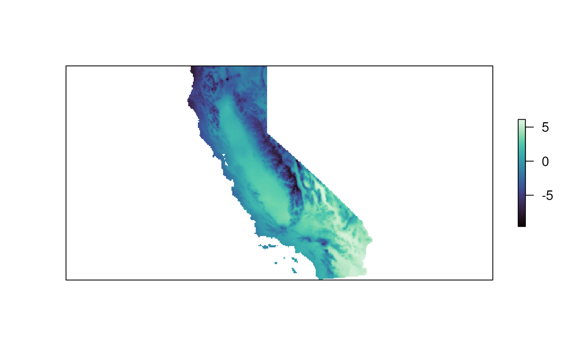
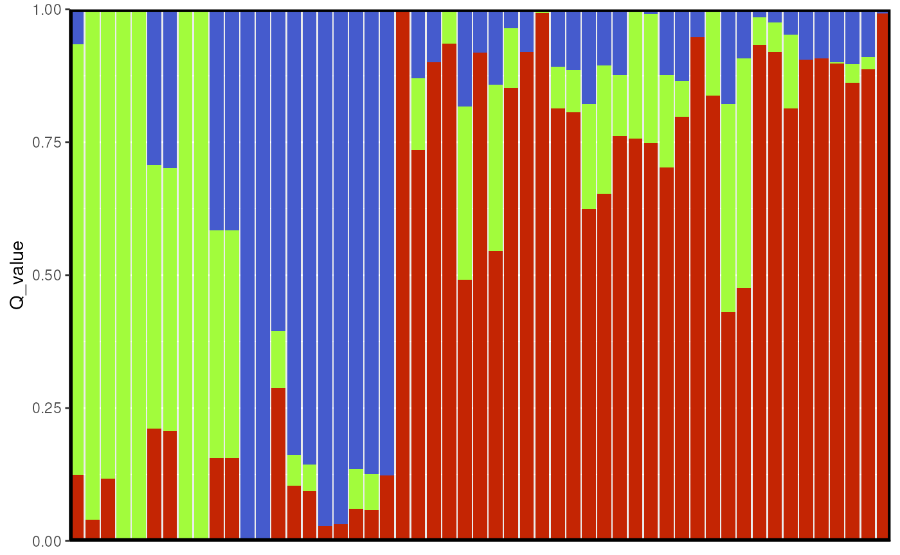

# TESS

## TESS

``` r

library(algatr)
```

``` r

# Install required packages
tess_packages()
```

``` r

library(here)
library(wingen)
library(tess3r)
library(ggplot2)
library(terra)
library(raster)
library(fields)
library(rworldmap)
library(automap)
library(cowplot)
library(sf)

# for plotting (from TESS)
source("http://membres-timc.imag.fr/Olivier.Francois/Conversion.R")
source("http://membres-timc.imag.fr/Olivier.Francois/POPSutilities.R")
#> [1] "Loading fields"
#> [1] "Loading RColorBrewer"
```

**If using TESS, please cite the following: Caye K., Deist T.M., Martins
H., Michel O., François O. (2016) TESS3: fast inference of spatial
population structure and genome scans for selection. Molecular Ecology
Resources 16(2):540-548. DOI: 10.1111/1755-0998.12471.**

TESS is a method to estimate population structure using ancestry
coefficient estimates. As with STRUCTURE, one first describes genetic
variation by assigning individuals according to numbers of clusters (K
values). Given the “best” number of K values, individuals are then given
proportions to which they belong to each K. These proportions correspond
to ancestry coefficients, and can be interpreted as the proportion of an
individual’s ancestry belonging to different ancestral groups. Keep in
mind that you may want to prune out any SNPs that may be in linkage
disequilibrium prior to running TESS so as not to bias or overinflate
the significance of results. Please refer to the data processing
vignette for information on how this can be done in algatr using the
[`ld_prune()`](https://thewanglab.github.io/algatr/reference/ld_prune.md)
function.

Unlike STRUCTURE, TESS is spatially explicit, taking into account
coordinate data; thus, ancestry coefficient estimates incorporate
knowledge of the sampling space. TESS3 ([Caye et
al. 2016](https://onlinelibrary.wiley.com/doi/10.1111/1755-0998.12471))
was later developed as an extension of the TESS algorithm, with
modifications to the underlying statistical clustering algorithm to
increase computational speed.

For additional information on the original development and
implementation of the algorithm used by TESS, see [François et
al. 2006](https://academic.oup.com/genetics/article/174/2/805/6061653?login=false)
and [Chen et
al. 2007](https://onlinelibrary.wiley.com/doi/10.1111/j.1471-8286.2007.01769.x).
Finally, our code primarily uses the tess3r package (see
[here](https://bcm-uga.github.io/TESS3_encho_sen/index.html) for
documentation).

#### Read in and process input data

Running TESS3 requires three data files: a genotype dosage matrix (the
`gen` argument), coordinates for samples (the `coords` argument), and
environmental layers (the `envlayers` argument). We can use a vcf and
the
[`vcf_to_dosage()`](https://thewanglab.github.io/algatr/reference/vcf_to_dosage.md)
function to convert a vcf to a dosage matrix.

``` r

load_algatr_example()
#> 
#> ---------------- example dataset ----------------
#>  
#> Objects loaded: 
#> *liz_vcf* vcfR object (1000 loci x 53 samples) 
#> *liz_gendist* genetic distance matrix (Plink Distance) 
#> *liz_coords* dataframe with x and y coordinates 
#> *CA_env* RasterStack with example environmental layers 
#> 
#> -------------------------------------------------
#> 
#> 
# Our code assumes that the first column is longitude and second is latitude; check this:
head(liz_coords)
#>           x        y
#> 1 -120.3972 41.56120
#> 3 -116.8923 34.16940
#> 5 -124.0408 40.90450
#> 7 -118.5614 37.78830
#> 8 -119.7194 37.72386
#> 9 -121.8467 36.35440
# Also, our code assumes that sample IDs from gendist and coords are the same order; be sure to check this before moving forward!
```

``` r

# Convert vcf to genotype matrix
liz_dosage <- vcf_to_dosage(liz_vcf)
#> Loading required namespace: adegenet
```

#### Process environmental data

algatr can create interpolated maps of the ancestry coefficient
estimates using a method known as kriging, which uses a spatially
explicit model for spatial interpolation. *N.B.: Be aware that tess3r
uses a different type of kriging to generate maps of ancestry
coefficients (algatr uses the
[`autoKrige()`](https://rdrr.io/pkg/automap/man/autoKrige.html) function
within the automap package), and tess3r performs this interpolation and
plotting in the same function, so there is no easy way to produce a
raster output.*

To generate a map, we need a raster onto which we can map Q values. We
can either retrieve this, or generate one ourselves using wingen’s
[`coords_to_raster()`](https://rdrr.io/pkg/wingen/man/coords_to_raster.html)
function. Please refer to the wingen documentation found
[here](https://github.com/AnushaPB/wingen), and the environmental data
vignette, for further information on this function.

``` r

# First, create a grid for kriging
# We can use one environmental layer (PC1), aggregated (i.e., increased cell size) to increase computational speed
krig_raster <- raster::aggregate(CA_env[[1]], fact = 6)

# If you want to see the difference between the non-aggregated (original) and aggregated rasters:
terra::plot(CA_env[[1]], col = mako(100), axes = FALSE)
```


``` r

terra::plot(krig_raster, col = mako(100), axes = FALSE)
```



### K selection

------------------------------------------------------------------------

algatr allows users with the option to test a range of K values using
the
[`tess_ktest()`](https://thewanglab.github.io/algatr/reference/tess_ktest.md)
function. K selection is often accomplished by minimizing the cross
entropy, but this can over-simplify K selection. The
[`tess_ktest()`](https://thewanglab.github.io/algatr/reference/tess_ktest.md)
function allows users to specify how K selection is done using the
`K_selection` argument; users can set the K values manually (`"manual"`)
or using an automatic approach described below (`"auto"`).
[`tess_ktest()`](https://thewanglab.github.io/algatr/reference/tess_ktest.md)
runs TESS for each value of K within the user-specified range, and
outputs cross-validation scores for different K values which allows a
user to select the “best” K for their dataset. Users have the option to
select the algorithm with which TESS will be run using the `tess_method`
argument; options for the argument are either projected least squares
algorithm (`"projected.ls"`; the default) or an alternating quadratic
programming algorithm (`"qp"`). Finally, as mentioned at the beginning
of the vignette, TESS is spatially explicit meaning that it can take
into account the distance between samples. The degree to which users
suspect spatial autocorrelation between data points can be controlled
using the spatial regularization (alpha) parameter, specified with the
`lambda` argument. Values closer to 1 samples geographically closer are
also suspected to be more genetically similar while values closer to 0
imply that there is little spatial autocorrelation.

#### Manual K selection

The default K selection (`"manual"`) within
[`tess_ktest()`](https://thewanglab.github.io/algatr/reference/tess_ktest.md)
runs TESS on a set of K values ranging from 1-10, and allows the user to
select the “best” K value manually based on cross-validation scores.
Typically, researchers will select the “best” K value by minimizing
cross-validation scores.

#### Automatic K selection

The other K selection method available is automatic K selection by
specifying `"auto"` within the
[`tess_ktest()`](https://thewanglab.github.io/algatr/reference/tess_ktest.md)
function. This method is based on not only minimizing cross-entropy
scores (which is typically done), but minimizes the slope of the line
that connects cross-entropy scores between K values. In this way, the
best K is selected once an “elbow” is visible, or when cross-entropy
scores begin to plateau and the slope approaches 0. This function makes
use of the approach described
[here](https://chazhyseni.github.io/NALgen/post/determining_bestk/).

The resulting object contains `tess3_obj`, which provides the
cross-validation scores for the different K values that were tested.
Let’s do the automatic K-value testing procedure once again for K values
1-10. As you can see, the
[`tess_ktest()`](https://thewanglab.github.io/algatr/reference/tess_ktest.md)
function outputs a plot with cross-validation scores for each K value,
with a red dashed line indicating the best K value obtained from the
automatic K selection procedure described above.

For this vignette, we’ll use automatic K selection.

``` r

# Best K is 3; this provides a more reasonable estimate for the "best" K compared to manual selection above
tess3_result <- tess_ktest(liz_dosage, liz_coords, Kvals = 1:10, ploidy = 2, K_selection = "auto")
```


#### K selection results from `test_ktest()`

The `tess3_result` object contains results for the best-supported K
value, including:

- `K`: The value of the best-supported K (3, in this case)

- `tess3_obj`: Results from the cross-validation analysis of all values
  of K

- `coords`: Sampling coordinates

- `Kvals`: The range of K values that were tested

- `grid`: The RasterLayer upon which ancestry coefficients are mapped;
  `NULL` in this case

- `pops`: Population assignments (determined based on the maximum Q
  value) for each individual for the best K value

#### Running TESS with no K selection

If you want to run TESS without any K selection, you could just run TESS
as normal by doing the following:

``` r

tess3_obj_noK <- tess3(liz_dosage, coord = as.matrix(liz_coords), K = 3, method = "projected.ls", ploidy = 2)
#> == Computing spectral decomposition of graph laplacian matrix: done
#> ==Main loop with 1 threads: done
```

The resulting object from the above run is a typical TESS output format
(it is also contained within the above `tess3_obj` object); see tess3r
vignette for details
[here](https://bcm-uga.github.io/TESS3_encho_sen/articles/main-vignette.html)
to read more.

### Extracting TESS results

------------------------------------------------------------------------

Now that we know which K value we want to use (K = 3) from our automatic
K selection results, we can move forward with TESS. We need to extract
the tess3 object from our results, and create a Q-matrix with ancestry
coefficient values from K = 3 using the
[`qmatrix()`](https://rdrr.io/pkg/tess3r/man/qmatrix.html) function with
which we can visualize results.

``` r

# Get TESS object and best K from results
tess3_obj <- tess3_result$tess3_obj
bestK <- tess3_result[["K"]]

# Get Qmatrix with ancestry coefficients
qmat <- qmatrix(tess3_obj, K = bestK)

# qmat contains ancestry coefficient values for each individual (row) and each K value (column)
head(qmat)
#>              [,1]         [,2]         [,3]
#> [1,] 8.875417e-06 8.875417e-06 9.999822e-01
#> [2,] 9.999818e-01 9.092916e-06 9.092916e-06
#> [3,] 1.297904e-01 1.353530e-01 7.348566e-01
#> [4,] 6.530853e-02 8.102963e-01 1.243952e-01
#> [5,] 9.936514e-02 9.814468e-06 9.006250e-01
#> [6,] 9.856749e-06 6.420386e-02 9.357863e-01
```

### Krige Q values

------------------------------------------------------------------------

The
[`tess_krig()`](https://thewanglab.github.io/algatr/reference/tess_krig.md)
function will take in ancestry coefficient values (in the Q-matrix) and
will krige the values based on the raster provided (`krig_raster` from
above). This will produce a Raster\* type object.

Coordinates and rasters used for kriging should be in a projected
(planar) coordinate system. Therefore, spherical systems (including
latitude-longitude coordinate systems) should be projected prior to use.
An example of how this can be accomplished is shown below. If no CRS is
provided, a warning will be given and the function will assume the data
are provided in a projected system.

``` r

# First, create sf coordinates (note: EPSG 4326 is WGS84/latitude-longitude)
coords_proj <- st_as_sf(liz_coords, coords = c("x", "y"), crs = 4326)

# Next, we project these coordinates to California Albers (EPSG 3310) since these coordinates are in California
coords_proj <- st_transform(coords_proj, crs = 3310)

# Finally, reproject the kriging raster to the same CRS as the coordinates
krig_raster <- projectRaster(krig_raster, crs = "epsg:3310")
# If you are using a SpatRaster you can reproject the coordinates like this:
# krig_raster <- terra::project(krig_raster, "epsg:3310")

# Now, we can run kriging using these coordinates
krig_admix <- tess_krig(qmat, coords_proj, krig_raster)
```

### Visualizing TESS results

------------------------------------------------------------------------

#### Bar plot of Q values

A typical representation for population structure results is a
STRUCTURE-style bar plot, in which each stacked bar represents an
individual and the proportion of stacked color represents the proportion
of ancestry assigned to that individual for each cluster (or K value).
In our case, we have K=3, so there will be three colors representing
each of these K values.

algatr has a custom function,
[`tess_barplot()`](https://thewanglab.github.io/algatr/reference/tess_barplot.md),
to generate these plots from our TESS results. This automatically sort
individuals based on their Q values (although this can be modified using
the `sort_by_Q` argument, if so desired); the outputted “order” message
indicates how individuals are ordered in the bar plot.

``` r

tess_barplot(qmat)
```


We can also build bar plots using ggplot2 with the
[`tess_ggbarplot()`](https://thewanglab.github.io/algatr/reference/tess_ggbarplot.md)
function.

``` r

tess_ggbarplot(qmat, legend = FALSE)
```



#### Building maps in TESS3 using `tess_ggplot()`

Now let’s explore how Q values (ancestry coefficients) are mapped. The
[`tess_ggplot()`](https://thewanglab.github.io/algatr/reference/tess_ggplot.md)
function will take in the kriged admixture values and sampling
coordinates (if the user wants points mapped), and provides several
options for the plot method (with the `plot_method` argument):

- `"maxQ"` plots only the maximum Q value for each cell (this is the
  default)

- `"allQ"` plots all Q-values that are greater than a user-specified
  `minQ` value

- `"maxQ_poly"` plots maxQ as polygons for each K-value instead of
  continuous Q values

- `"allQ_poly"` plots allQ as polygons for each K-value instead of
  continuous Q values

``` r

par(mfrow = c(2, 2), pty = "s", mar = rep(0, 4))

tess_ggplot(krig_admix, plot_method = "maxQ")
```


``` r

tess_ggplot(krig_admix, plot_method = "allQ", minQ = 0.20)
#> $plot
```


    #> 
    #> $legend
    #> Warning: Using alpha for a discrete variable is not advised.


``` r

tess_ggplot(krig_admix, plot_method = "maxQ_poly")
```


``` r

tess_ggplot(krig_admix, plot_method = "allQ_poly", minQ = 0.20)
```


#### Extended plotting

In many cases, a user may want more customizability in mapping their
TESS results. If users want more control over color, they can use the
`ggplot_fill` argument. Also, if users they want x and y axes to be
displayed, this can be set using the `plot_axes` argument:

``` r

tess_ggplot(krig_admix, 
            plot_method = "maxQ", 
            ggplot_fill = scale_fill_manual(values = c("#bd9dac", "#257b94", "#476e9e")),
            plot_axes = TRUE, 
            coords = coords_proj)
```


We may also want to plot individual layers (K values), which we can
using
[`tess_plot_allK()`](https://thewanglab.github.io/algatr/reference/tess_plot_allK.md).

``` r

par(mfrow = c(1, nlyr(krig_admix)), mar = rep(2, 4), oma = rep(1, 4))
tess_plot_allK(krig_admix, col_breaks = 20, legend.width = 2)
```


For extra flexibility, we also provide a
[`geom_tess()`](https://thewanglab.github.io/algatr/reference/geom_tess.md)
function that users can add to existing ggplot objects to plot Q values.
This function takes in the kriged admixture values and the plot method
(as described above).

``` r

plt <-
  ggplot() +
  geom_tess(krig_admix, plot_method = "maxQ") +
  # This allows you to add additional geoms to the plot such as state boundaries or sample coordinates
  geom_sf(data = coords_proj, color = "black", pch = 3) +
  # You can also use a custom color palette
  scale_fill_manual(values = c("magenta3", "cyan3", "orange3")) +
  # And control any other aspect of the ggplot theme
  theme_void() 

# If you want to add our custom TESS legend, you can do so using the tess_legend() function
leg <- 
  tess_legend(krig_admix, plot_method = "maxQ") +
  # Make sure to add your custom color palette to the legend
  scale_fill_manual(values = c("magenta3", "cyan3", "orange3"))

# Remove the original legend from the plot
plt <- plt + theme(legend.position = "none")

# Then use cowplot to combine the two plots
# (You can ignore any warnings about using alpha for a discrete variable)
# rel_widths controls the relative size of the plot to the legend
# ncol controls the number of columns in the plot grid
cowplot::plot_grid(plt, leg, ncol = 2, rel_widths = c(5, 1))
```


### Plotting with default tess3r package functions

You can, of course, also plot TESS results using the tess3r package
defaults and not those provided with algatr. The TESS function for a
barplot is
[`barplot()`](https://rspatial.github.io/terra/reference/barplot.html).

``` r

barplot(qmat, sort.by.Q = TRUE, border = NA, space = 0, xlab = "Individuals", ylab = "Ancestry coefficients")
#> Use CreatePalette() to define color palettes.
```


    #> $order
    #>  [1]  4 13 20 28 29 31 32 35 36 52 53  2 10 19 24 25 40 41 49 50 51  1  3  5  6
    #> [26]  7  8  9 11 12 14 15 16 17 18 21 22 23 26 27 30 33 34 37 38 39 42 43 44 45
    #> [51] 46 47 48

You can also map kriged Q-values using tess3r with the
[`plot()`](https://rspatial.github.io/terra/reference/plot.html)
function.

``` r

# TESS requires a coordinate matrix, so we need to convert the sf object to a matrix
coords_proj_mat <- st_coordinates(coords_proj)

plot(qmat,
  coords_proj_mat,
  method = "map.max",
  interpol = FieldsKrigModel(10),
  main = "Ancestry coefficients",
  xlab = "x", ylab = "y",
  col.palette = CreatePalette(),
  resolution = c(300, 300), cex = .4
)
#> Warning: 
#> Grid searches over lambda (nugget and sill variances) with  minima at the endpoints: 
#>   (REML) Restricted maximum likelihood 
#>    minimum at  right endpoint  lambda  =  0.06699675 (eff. df= 38.95001 )
#> Warning: 
#> Grid searches over lambda (nugget and sill variances) with  minima at the endpoints: 
#>   (REML) Restricted maximum likelihood 
#>    minimum at  right endpoint  lambda  =  0.06699675 (eff. df= 38.95001 )
```


As you can see from the above, interpolation is done using a different
method in tess3r, which is why the resulting smoothed surface differs
from than produced using algatr.

### Running TESS with `tess_do_everything()`

------------------------------------------------------------------------

The algatr package also has an option to run all of the above
functionality in a single function,
[`tess_do_everything()`](https://thewanglab.github.io/algatr/reference/tess_do_everything.md).
*N.B.: the
[`tess_do_everything()`](https://thewanglab.github.io/algatr/reference/tess_do_everything.md)
function does not require a dosage matrix; it will do the conversion
automatically if a vcf is provided*. **Please be aware that the
`do_everything()` functions are meant to be exploratory. We do not
recommend their use for final analyses unless certain they are properly
parameterized.**

The
[`tess_do_everything()`](https://thewanglab.github.io/algatr/reference/tess_do_everything.md)
function will print out the barplot, the cross-validation scores for the
range of K values tested, and the kriged map (if a grid is provided). It
will also print the order in which individuals are ordered in the
barplot. The resulting object from this function contains:

- `K`: The best K value based on user-specified K selection

- `Qmatrix`: The matrix of individual ancestry coefficients, or Q values

- `krig_admix`: A RasterBrick object containing the kriged ancestry
  coefficient values for mapping; if no grid is provided, the function
  will skip kriging

- `tess_results`: The tess3r object containing cross-entropy scores for
  each K value tested

- `coords`: Sampling coordinates

- `Kvals`: Range of K values that were tested

- `grid`: The RasterLayer upon which Q values will be mapped

``` r

# One could also use krig_raster as the grid object
results <- tess_do_everything(liz_vcf, coords_proj, grid = krig_raster, Kvals = 1:10, K_selection = "auto")
#> Please be aware: the do_everything functions are meant to be exploratory. We do not recommend their use for final analyses unless certain they are properly parameterized.
```


### Additional documentation and citations

------------------------------------------------------------------------

|  | Citation/URL | Details |
|----|----|----|
| Main literature | [Caye et al. 2016](https://onlinelibrary.wiley.com/doi/10.1111/1755-0998.12471); vignette available [here](https://bcm-uga.github.io/TESS3_encho_sen/articles/main-vignette.html) | Citation for TESS3 |
| Associated literature | [François et al. 2006](https://academic.oup.com/genetics/article/174/2/805/6061653?login=false) | Details on algorithm used by TESS |
| Associated literature | [Chen et al. 2007](https://onlinelibrary.wiley.com/doi/10.1111/j.1471-8286.2007.01769.x) | Details on algorithm used by TESS |
| Blog post | [Automatic K selection](https://chazhyseni.github.io/NALgen/post/determining_bestk/) | Details on automatic K selection used by algatr |
