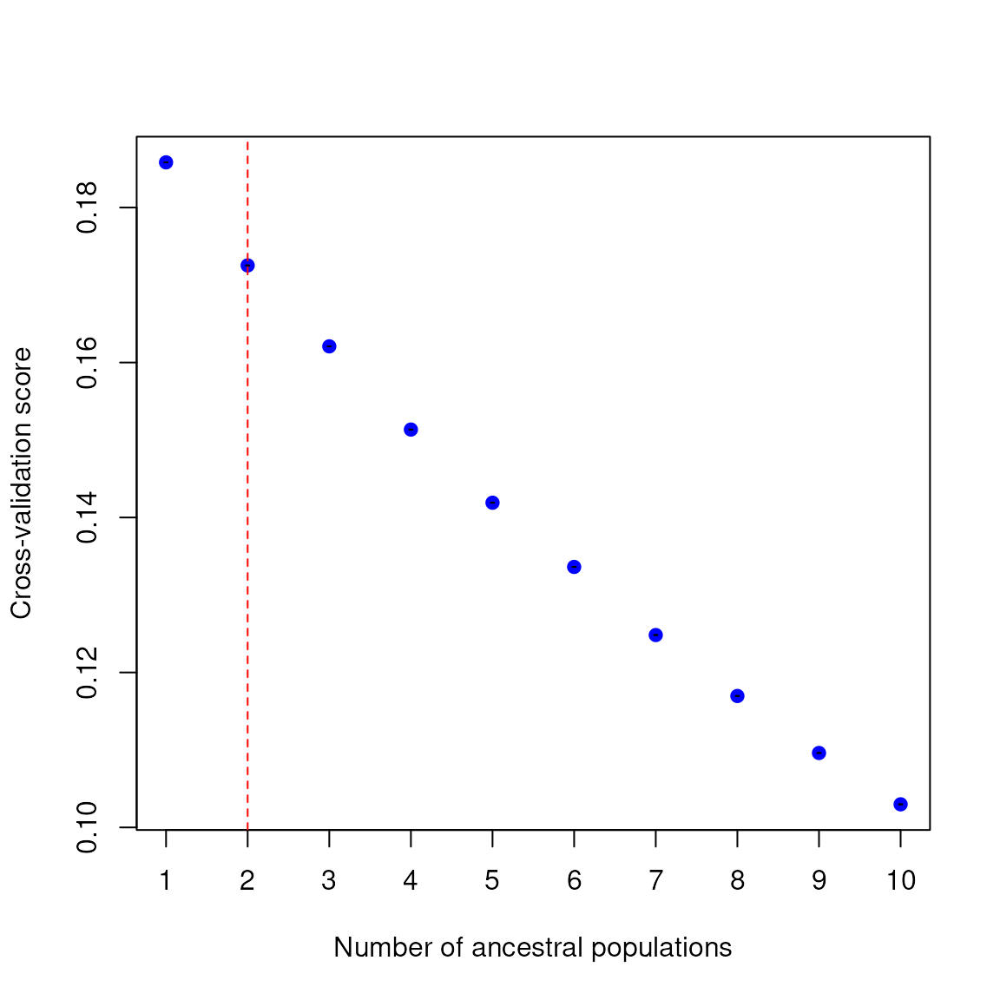
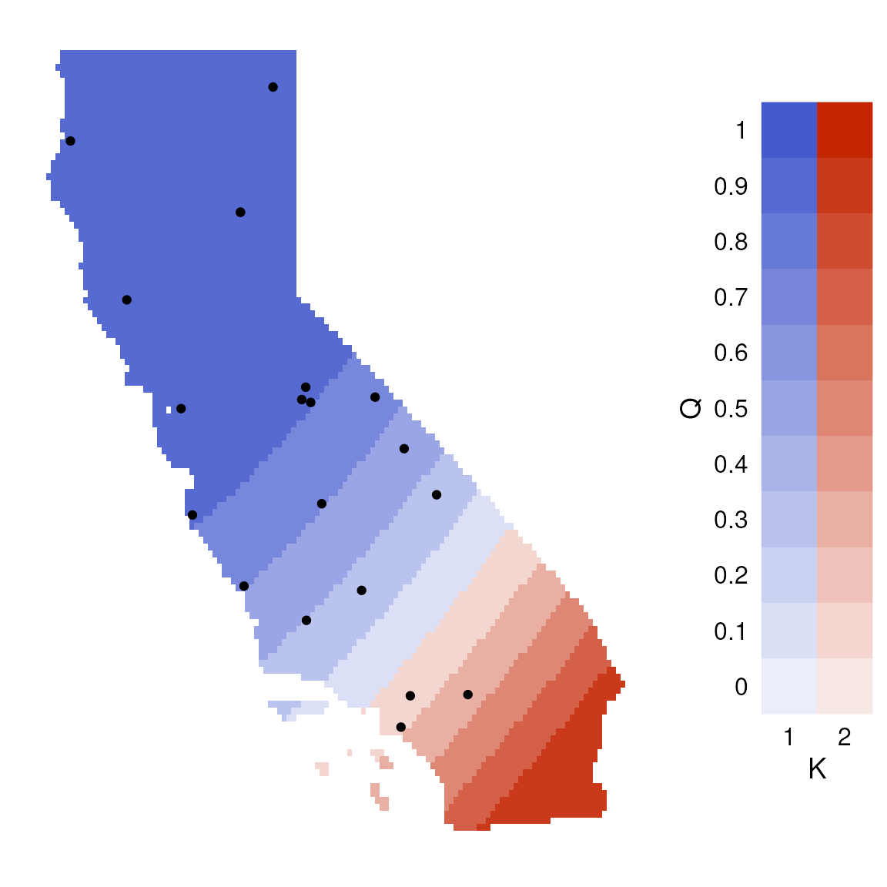
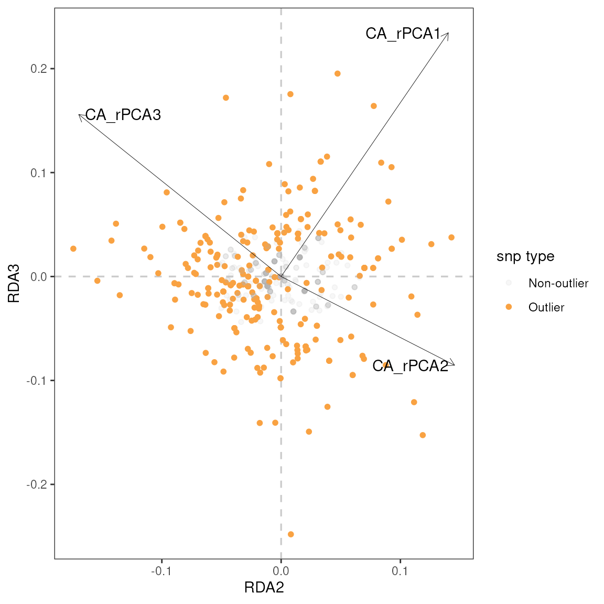
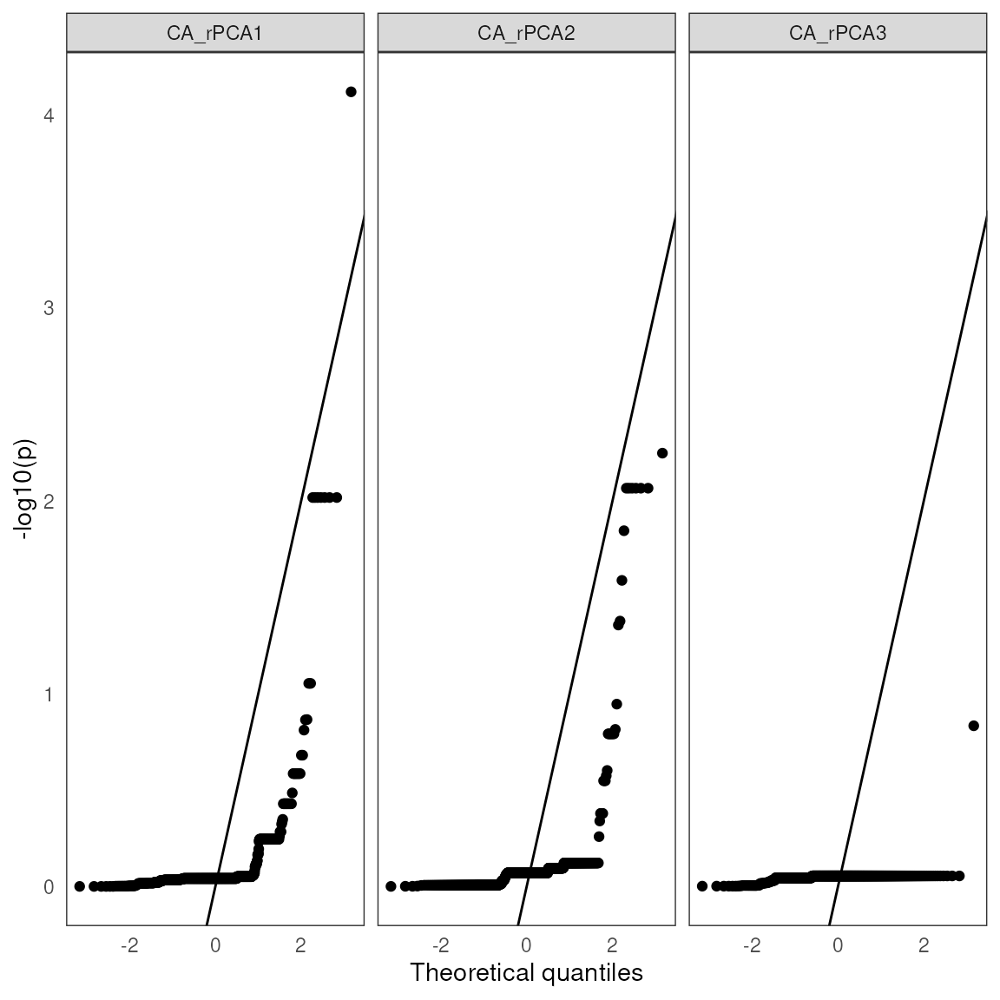

# Alazygatr

``` r

library(algatr)
```

Install all of the required packages:

``` r

alazygatr_packages()
```

Are you a lazy algatr? The
[`do_everything_for_me()`](https://thewanglab.github.io/algatr/reference/do_everything_for_me.md)
function runs all six landscape genomic methods in the algatr package
(wingen, TESS, GDM, MMRR, RDA, and LFMM) and provides limited options
for customizability. This function primarily exists for fun and to
demonstrate that algatr really can be run using on a vcf and sampling
coordinates; we **do not** encourage researchers to actually perform
analyses on their data using this function!

The main arguments within this function are simple: `vcf` specifies the
vcf, `coords` specifies the sampling coordinates, and `envlayers`
specifies the environmental layers (not required). As usual, make sure
your samples are in the same order between your data file and
coordinates file and that your CRS is consistent!

First, let’s load our test data. For the sake of things running quickly,
let’s run this function on only 20 individuals from the test dataset.

``` r

load_algatr_example()
```

``` fansi
## 
## ---------------- example dataset ----------------
##  
## Objects loaded: 
## *liz_vcf* vcfR object (1000 loci x 53 samples) 
## *liz_gendist* genetic distance matrix (Plink Distance) 
## *liz_coords* dataframe with x and y coordinates 
## *CA_env* RasterStack with example environmental layers 
## 
## -------------------------------------------------
## 
```

    ## 

``` r

gen <- liz_vcf[, 1:21]
```

    ## Loading required namespace: vcfR

``` r

coords <- liz_coords[1:20, ]
envlayers <- CA_env
```

Now, let’s run the function:

``` r

lazy_results <- do_everything_for_me(gen, coords, envlayers, quiet = FALSE)
```



[TABLE]

| predictor | coefficient |
|----|----|
|  |  |
| Geographic | 0.66 |
| CA_rPCA1 | 0.00 |
| CA_rPCA2 | 0.31 |
| CA_rPCA3 | 0.00 |
|  |  |
| % Explained: | 24.52¹ |
| ¹ The percentage of null deviance explained by the fitted GDM model. |  |



| r     | p    | snp        | var      |
|-------|------|------------|----------|
| 0.61  | 0.00 | Locus_1841 | CA_rPCA3 |
| -0.58 | 0.00 | Locus_1319 | CA_rPCA2 |
| -0.58 | 0.00 | Locus_2394 | CA_rPCA2 |
| -0.53 | 0.00 | Locus_1247 | CA_rPCA2 |
| -0.52 | 0.01 | Locus_2733 | CA_rPCA2 |
| -0.51 | 0.01 | Locus_2602 | CA_rPCA2 |
| -0.49 | 0.01 | Locus_3143 | CA_rPCA2 |
| -0.48 | 0.01 | Locus_2665 | CA_rPCA3 |
| 0.47  | 0.01 | Locus_350  | CA_rPCA3 |
| 0.46  | 0.01 | Locus_2400 | CA_rPCA3 |



| snp | variable | B¹ | z-score | p-value | calibrated z-score | calibrated p-value | adjusted p-value |
|----|----|----|----|----|----|----|----|
| Locus_90 | CA_rPCA1 | 0.24 | 4.36 | 0 | 28.07 | 0 | 0.00 |
| Locus_1278 | CA_rPCA2 | -0.21 | -4.89 | 0 | 15.27 | 0 | 0.01 |
| Locus_1318 | CA_rPCA2 | -0.21 | -4.89 | 0 | 15.27 | 0 | 0.01 |
| Locus_1801 | CA_rPCA2 | -0.21 | -4.89 | 0 | 15.27 | 0 | 0.01 |
| Locus_2045 | CA_rPCA2 | -0.21 | -4.89 | 0 | 15.27 | 0 | 0.01 |
| Locus_2947 | CA_rPCA2 | -0.21 | -4.89 | 0 | 15.27 | 0 | 0.01 |
| Locus_1724 | CA_rPCA2 | -0.20 | -4.27 | 0 | 11.62 | 0 | 0.04 |
| Locus_1247 | CA_rPCA2 | -0.19 | -5.57 | 0 | 19.76 | 0 | 0.01 |
| Locus_1477 | CA_rPCA2 | 0.17 | 4.70 | 0 | 14.06 | 0 | 0.01 |
| Locus_786 | CA_rPCA2 | -0.17 | -4.22 | 0 | 11.36 | 0 | 0.04 |
| ¹ LFMM effect size |  |  |  |  |  |  |  |

The
[`do_everything_for_me()`](https://thewanglab.github.io/algatr/reference/do_everything_for_me.md)
function returns a list with each analysis’s results as objects named
according to the method. These formats are identical to those obtained
when running respective “do_everything” functions (e.g.,
[`tess_do_everything()`](https://thewanglab.github.io/algatr/reference/tess_do_everything.md)
function output is identical to that within the `tess` object).

For methods with model selection (e.g., GDM and MMRR), the default of
[`do_everything_for_me()`](https://thewanglab.github.io/algatr/reference/do_everything_for_me.md)
is to run with model selection (`"best"`), and if no significant
variables are found, the function will revert to running the `"full"`
model for these methods.
