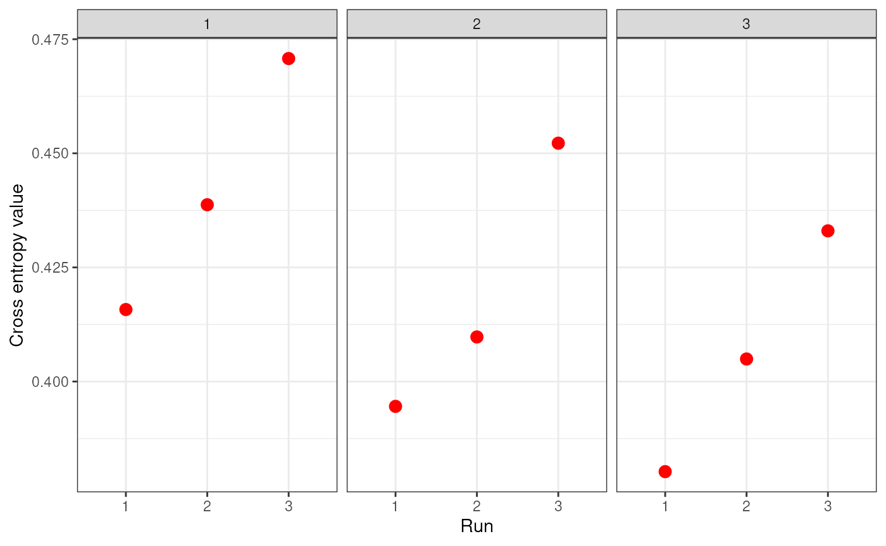
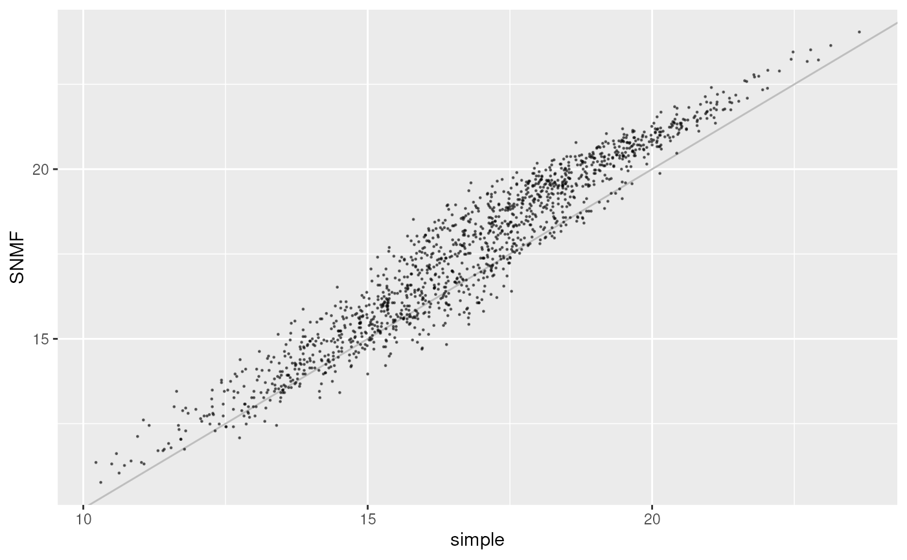
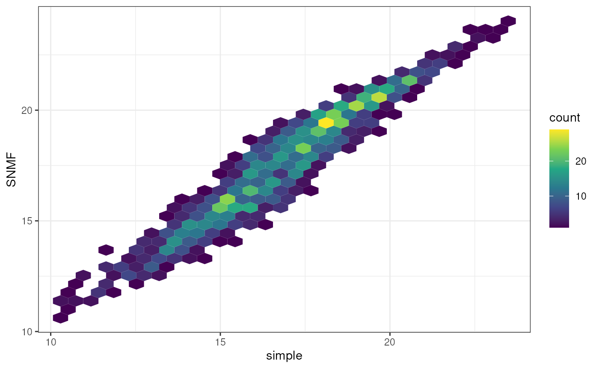

# Genetic data processing

## Processing genomic data files

``` r

library(algatr)
```

``` r

# Install required packages
data_processing_packages()
```

``` r

library(purrr)
library(dplyr)
library(ggplot2)
library(here)
```

For landscape genomic analyses, we first need to process our input data
files in various ways. It is important to understand what this data
processing is doing, so in this vignette, we’ll do the following:

- [`vcf_to_dosage()`](https://thewanglab.github.io/algatr/reference/vcf_to_dosage.md)
  to convert a vcf file to a dosage matrix

- [`str_impute()`](https://thewanglab.github.io/algatr/reference/str_impute.md)
  and
  [`simple_impute()`](https://thewanglab.github.io/algatr/reference/simple_impute.md)
  to impute missing data in two different ways

- [`ld_prune()`](https://thewanglab.github.io/algatr/reference/ld_prune.md)
  to prune variants that are in linkage disequilibrium with one another;
  this primarily uses the `snpgdsLDpruning()` function within the
  SNPRelate package ([Zheng et
  al. 2012](https://academic.oup.com/bioinformatics/article/28/24/3326/245844);
  see
  [here](https://www.bioconductor.org/packages/release/bioc/manuals/SNPRelate/man/SNPRelate.pdf)
  for further information)

### Converting a vcf to a dosage matrix with `vcf_to_dosage()`

------------------------------------------------------------------------

Recall the way genotypes are encoded within a vcf: `"0/0"` denotes
individual is homozygous for the reference allele, `"0/1"` for
heterozygote, and `"1/1"` for a homozygote for the alternate allele;
`NA` is missing data.

``` r

# Load the example data
load_algatr_example()
#> 
#> ---------------- example dataset ----------------
#>  
#> Objects loaded: 
#> *liz_vcf* vcfR object (1000 loci x 53 samples) 
#> *liz_gendist* genetic distance matrix (Plink Distance) 
#> *liz_coords* dataframe with x and y coordinates 
#> *CA_env* RasterStack with example environmental layers 
#> 
#> -------------------------------------------------
#> 
#> 

# Look at genotypes for five individuals at eight sites:
liz_vcf@gt[1:8, 2:6]
#>      ALT3  BAR360 BLL5  BNT5  BOF1 
#> [1,] "0/0" "0/0"  "0/0" "0/0" "0/0"
#> [2,] "0/0" "0/0"  NA    "0/0" NA   
#> [3,] "0/0" "0/0"  "0/0" NA    NA   
#> [4,] "0/0" NA     "0/0" NA    NA   
#> [5,] "0/0" "0/0"  NA    "0/0" NA   
#> [6,] NA    "0/0"  "0/0" "0/0" NA   
#> [7,] NA    "0/0"  "0/0" NA    "0/0"
#> [8,] "1/1" "1/1"  "0/1" "0/0" "0/0"
```

A dosage matrix contains each row as an individual (unlike a vcf) and
each column as a site. Importantly, genotypes are now encoded with a
single number. For a diploid organism, there are three possibilities for
coding genotypes in a dosage matrix: 0, 1, or 2 (corresponding to 0/0,
1/1, and 0/1 from the vcf, respectively). `NA` still represents missing
data. We can convert our vcf to a dosage matrix using the
[`vcf_to_dosage()`](https://thewanglab.github.io/algatr/reference/vcf_to_dosage.md)
function:

``` r

dosage <- vcf_to_dosage(liz_vcf)
#> Loading required namespace: vcfR
#> Loading required namespace: adegenet

# Look at genotypes for five individuals at five sites:
dosage[1:5, 1:8]
#>        Locus_10 Locus_15 Locus_22 Locus_28 Locus_32 Locus_35 Locus_37 Locus_61
#> ALT3          0        0        0        0        0       NA       NA        2
#> BAR360        0        0        0       NA        0        0        0        2
#> BLL5          0       NA        0        0       NA        0        0        1
#> BNT5          0        0       NA       NA        0        0       NA        0
#> BOF1          0       NA       NA       NA       NA       NA        0        0
```

### Imputation of missing values

------------------------------------------------------------------------

Because of their underlying statistical framework, several landscape
genomics methods cannot accept any missing data as input. Within algatr,
the two GEA methods (RDA and LFMM) are examples of such methods. To deal
with inevitable missing data, researchers typically perform imputation,
wherein values are assigned to missing data based on some criteria. For
example, the most simplistic imputation could be one in which missing
values are imputed based on the median value across all individuals; one
can imagine that this is extremely simplistic and assumes a lot about
the data and samples. There have been quite a few developments in
missing data imputation in recent years; we suggest you take a look at
[Money et al. 2015](https://doi.org/10.1534/g3.115.021667) and [Shi et
al. 2018](https://doi.org/10.1159/000489758) as a starting point for
examples of how this can be done.

algatr has the functionality to impute missing values in two ways: the
simplistic median-based approach described above using
[`simple_impute()`](https://thewanglab.github.io/algatr/reference/simple_impute.md)
and a more sophisticated imputation method,
[`str_impute()`](https://thewanglab.github.io/algatr/reference/str_impute.md)
that uses underlying population structure to assign missing values.
Let’s first take a look at
[`simple_impute()`](https://thewanglab.github.io/algatr/reference/simple_impute.md)
using the dosage matrix we just generated in the step prior to this one:

``` r

# Are there NAs in the data?
dosage[1:5, 1:5]
#>        Locus_10 Locus_15 Locus_22 Locus_28 Locus_32
#> ALT3          0        0        0        0        0
#> BAR360        0        0        0       NA        0
#> BLL5          0       NA        0        0       NA
#> BNT5          0        0       NA       NA        0
#> BOF1          0       NA       NA       NA       NA
simple_dos <- simple_impute(dosage)
# Check that NAs are gone
simple_dos[1:5, 1:5]
#>        Locus_10 Locus_15 Locus_22 Locus_28 Locus_32
#> ALT3          0        0        0        0        0
#> BAR360        0        0        0        0        0
#> BLL5          0        0        0        0        0
#> BNT5          0        0        0        0        0
#> BOF1          0        0        0        0        0
```

Now, let’s use
[`str_impute()`](https://thewanglab.github.io/algatr/reference/str_impute.md)
to impute missing values based on population structure. This function
does two main things: (1) it runs SNMF to generate ancestry coefficients
based on a single or range of K-values; and (2) it uses the
[`LEA::impute()`](https://rdrr.io/pkg/LEA/man/impute.html) function to
impute missing values based on the SNMF results. In this way, this
imputation method is taking into consideration population structure and
assuming that individuals sharing the same ancestral clusters are more
similar to one another; certainly, this is a better assumption than
imputing based on the median across all individuals.

There are a number of arguments in the
[`str_impute()`](https://thewanglab.github.io/algatr/reference/str_impute.md)
function, most of which inherit from
[`LEA::snmf()`](https://rdrr.io/pkg/LEA/man/main_sNMF.html):

- `gen` specifies the genotype data and can be a dosage matrix, vcfR
  object, path to vcf file, or an sNMF project (i.e., object of type
  snmfProject) if you’ve already run SNMF and want to use that for
  imputation

- `K` specifies a single value or range of K-values for sNMF to be run

- `entropy` whether to calculate cross-entropy criteria (defaults to
  TRUE)

- `repetitions` specifies the number of repetitions (or runs) to do for
  each K-value (defaults to 10)

- `project` specifies whether you want to start a new sNMF project
  (`"new"`; default), whether you want to continue an existing SNMF
  project (`"continue"`) or overwrite existing results (`"force"`)

- `quiet` produces a plot of the cross-entropy scores for each K value
  from sNMF, if set to FALSE. The default is for nothing to be printed
  (quiet = TRUE). The best K value from the sNMF results is based on
  minimizing cross-entropy scores

- `save_output` specifies whether you would like output files to be
  saved to file (a string) or not (left NULL; this is the default). If a
  string is provided, output files will be saved with this argument’s
  string as a prefix. Files to be saved include SNMF results, the
  original dosage matrix as .geno and .lfmm files, and an imputed .lfmm
  file

``` r

str_dos <- str_impute(gen = dosage, K = 1:3, entropy = TRUE, repetitions = 3, quiet = FALSE, save_output = FALSE)
```



Let’s take a look at how the two imputation methods compare by
calculating genetic distances for each and then using the
[`gen_dist_corr()`](https://thewanglab.github.io/algatr/reference/gen_dist_corr.md)
function which plots the relationship between two distance metrics
(please see the genetic distances vignette for further information).

``` r

str_dist <- as.matrix(ecodist::distance(str_dos, method = "euclidean"))
simple_dist <- as.matrix(ecodist::distance(simple_dos, method = "euclidean"))
gen_dist_corr(dist_x = simple_dist, dist_y = str_dist, metric_name_x = "simple", metric_name_y = "SNMF")
```



### Removing sites that are in linkage disequilibrium using `ld_prune()`

------------------------------------------------------------------------

For some analyses, we may want to prune out any linked sites from our
data to not bias results. This is particularly the case with methods
that estimate population structure (e.g., TESS), as population structure
can be overinflated as more SNPs appear to independently support the
same pattern. For other analyses - such as genotype-environment
association methods like RDA and LFMM - SNPs in LD are sometimes removed
prior to running such analyses, but we do not recommend this because
SNPs most strongly associated with environmental variables may have been
pruned out. However, failing to account for linkage may result in
overinflated conclusions about environmental associations. A solution to
this is to perform LD-pruning after having run GEA methods; one approach
to do so is to retain SNPs with the strongest association (i.e., lowest
p-value) and removing all others that are in linkage with that
particular SNP (see the approach described in Capblancq & Forester 2021
for more information).

To perform LD-pruning, we can use the
[`ld_prune()`](https://thewanglab.github.io/algatr/reference/ld_prune.md)
function (which largely uses the `snpgdsLDpruning()` function within the
SNPRelate package). The function works by first removing any variants
that occur below a given minor allele frequency, and then by pruning any
variants that have a given correlation using a sliding window approach.

The main arguments within this function are as follows:

- `ld.threshold` specifies the LD pruning threshold (the default is the
  correlation coefficient value; thus, the higher the `ld.threshold`
  value, fewer variants will be pruned)

- `slide.max.n` specifies the maximum number of SNPs in the sliding
  window (defaults to 100)

- `maf` specifies the minor allele frequency (defaults to 0.05)

- `vcf` specifies the path to the vcf file that you would like to be
  pruned

- `out_name` specifies the prefix of output file names

- `out_format` specifies the file type (options are `"vcf"` for vcf and
  gds files \[default\], or `"plink"` for ped and map files)

- `save_output` specifies whether you would like a new directory made
  containing all output (and intermediate) files; default is `TRUE.` If
  set to `FALSE`, the function will simply return a vcf object.

The way to call this function is as follows:

`vcf_ldpruned <- ld_prune(vcf = "test.vcf", out_name = "liz", out_format = "vcf", ld.threshold = 0.9, slide.max.n = 10)`

We will not be running this function within the vignette to avoid
generating intermediate files, but the example line above creates a new
directory called liz_LDpruned, and it contains five files: a LOGFILE,
with information on how many sites were pruned and how many remain,
three gds files (pre- and post-pruned SNP GDS files and a GDS SeqArray
file), and the pruned vcf. All of these output files are named such that
the `ld.threshold` and `slide.max.n` parameter settings are contained in
file names.

### Additional options for data visualization

------------------------------------------------------------------------

An alternate way to visualize matrices that can be helpful when you have
many overlapping data points is using the
[`geom_hex()`](https://ggplot2.tidyverse.org/reference/geom_hex.html)
function in the ggplot2 package. This plotting style bins data points
into hexagons that are colorized based on the number of data points
contained within the hexagon.

Let’s take a look at this style of plot using the comparison between
imputed genetic distances we generated earlier in this vignette. To
makes things easy, let’s re-run the
[`gen_dist_corr()`](https://thewanglab.github.io/algatr/reference/gen_dist_corr.md)
function and extract the data from the output. This way, it’s already
been processed for us.

``` r

if (!require("hexbin", quietly = TRUE)) install.packages("hexbin")
library(hexbin)
```

``` r

# Gather data
plot <- gen_dist_corr(dist_x = simple_dist, dist_y = str_dist, metric_name_x = "simple", metric_name_y = "SNMF")

# Now, build plot
ggplot(plot$data, aes(x = simple, y = SNMF) ) +
  geom_hex() +
  theme_bw() +
  scale_fill_continuous(type = "viridis")
```



### Additional documentation and citations

------------------------------------------------------------------------

|  | Citation/URL | Details |
|----|----|----|
| Associated code | [Zheng et al. 2012](https://academic.oup.com/bioinformatics/article/28/24/3326/245844); further details [here](https://www.bioconductor.org/packages/release/bioc/manuals/SNPRelate/man/SNPRelate.pdf) | algatr uses the `snpgdsLDpruning()` function within the SNPRelate package for LD-pruning |

Retrieve SNPRelate’s vignette:

``` r

vignette("SNPRelate")
#> starting httpd help server ... done
```
