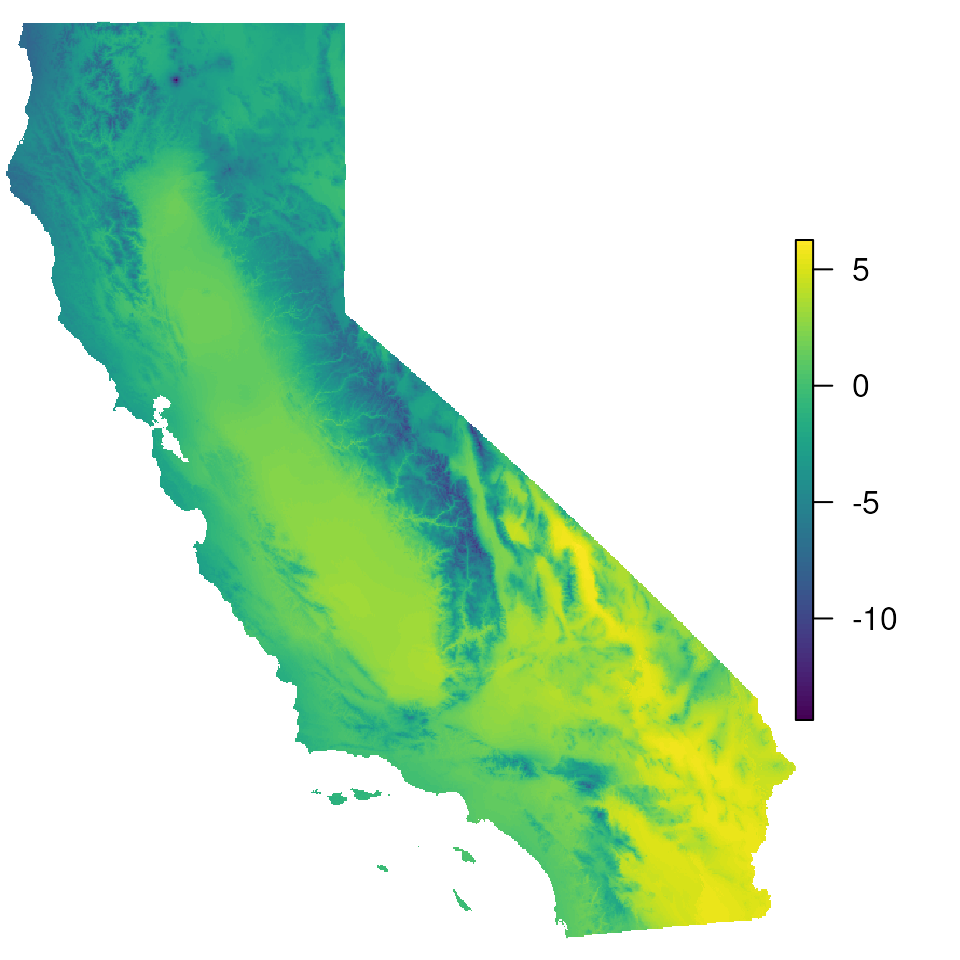

# Masking

## Masking maps for landscape genomics

``` r

library(algatr)
```

``` r

# Install required packages
masking_packages()
```

``` r

library(raster)
library(terra)
library(viridis)
library(geodata)
library(here)
```

Often, we may want to mask areas of maps to visualize landscape genomics
results. For example, we may want to mask areas beyond a study
organism’s range, or in areas that are undersampled (or not sampled at
all). This allows users to avoid over-interpreting results from several
analyses where mapping is a useful visualization tool (e.g., generalized
dissimilarity modeling).

This vignette makes use of the following masking functions:

- [`extrap_mask()`](https://thewanglab.github.io/algatr/reference/extrap_mask.md)
  function to reduce extrapolation by masking areas that fall outside
  the data (either based on environmental or spatial coverage)

- [`rm_islands()`](https://thewanglab.github.io/algatr/reference/rm_islands.md)
  masks specified islands from map

#### Read in data

``` r

# Load test data, including CA_env which are the environmental raster layers we'll be using
load_algatr_example()
#> 
#> ---------------- example dataset ----------------
#>  
#> Objects loaded: 
#> *liz_vcf* vcfR object (1000 loci x 53 samples) 
#> *liz_gendist* genetic distance matrix (Plink Distance) 
#> *liz_coords* dataframe with x and y coordinates 
#> *CA_env* RasterStack with example environmental layers 
#> 
#> -------------------------------------------------
#> 
#> 

# For the purposes of simplicity, let's just use one of the PCs for mapping:
envlayers <- CA_env$CA_rPCA1

# And now let's convert our PC to a terra SpatRaster object:
envlayers <- terra::rast(envlayers)

par(mar = c(0, 0, 0, 0))
# Let's take a look at the map with no masking:
plot(envlayers, col = viridis(100), axes = FALSE, box = FALSE)
```



### Making masked maps

------------------------------------------------------------------------

#### Make a range-based based

We can use the
[`extrap_mask()`](https://thewanglab.github.io/algatr/reference/extrap_mask.md)
function to mask all areas outside range of environmental values
included in data (the `"range"` argument). This argument masks
conservatively, meaning that if any area falls outside the range of the
data for any variable, the area is masked.

``` r

par(mar = c(0, 0, 0, 0))

# Extrapolate env values for given coordinates
map_mask <- extrap_mask(liz_coords, envlayers, method = "range")

# To make the map, we simply plot the base map (`envlayers`) and the 
# created masking layer in black (`map_mask`) on top of one another:
terra::plot(envlayers)
terra::plot(map_mask, col = "black", add = TRUE, legend = FALSE)
```


#### Standard deviation-based mask

We can also mask using the `"sd"` argument, which masks all areas
outside of the mean, +/- some number of standard deviations outside the
environmental values included in data (normalized using the `nsd`
parameter). This method is still as conservative as the `"range"`
argument from above.

``` r

par(mar = c(0, 0, 0, 0))

# Let's start with nsd=2
map_mask <- extrap_mask(liz_coords, envlayers, method = "sd", nsd = 2)
terra::plot(envlayers)
terra::plot(map_mask, col = "black", add = TRUE, legend = FALSE)
```


``` r


# Now, increase nsd to 3 and see how the map masking changes:
map_mask <- extrap_mask(liz_coords, envlayers, method = "sd", nsd = 3)
terra::plot(envlayers)
terra::plot(map_mask, col = "black", add = TRUE, legend = FALSE)
```


#### Buffer-based mask

We can mask all areas outside of a circular buffer of a fixed width
around the coordinates provided using the `"buffer"` argument. Given how
the buffer is calculated, this masking is agnostic to environment. We
can adjust the size of the circular buffer using the `buffer_width`
option.

``` r

par(mar = c(0, 0, 0, 0))

map_mask <- extrap_mask(liz_coords, envlayers, method = "buffer", buffer_width = 0.25)
terra::plot(envlayers)
terra::plot(map_mask, col = "black", add = TRUE, legend = FALSE)
```


``` r


# Increase buffer size
map_mask <- extrap_mask(liz_coords, envlayers, method = "buffer", buffer_width = 0.5)
terra::plot(envlayers)
terra::plot(map_mask, col = "black", add = TRUE, legend = FALSE)
```


``` r


# Increase buffer size and change masking color and transparency
map_mask <- extrap_mask(liz_coords, envlayers, method = "buffer", buffer_width = 1)
terra::plot(envlayers)
terra::plot(map_mask, col = "white", add = TRUE, legend = FALSE, alpha = 0.5)
```


#### Convex hull-based mask

A convex hull describes the smallest convex polygon that contains sets
or points (in this case, sampling coordinates). We can mask all areas
outside of a convex hull around the coordinates provided using the
`"chull"` argument (this largely uses the `st_convex_hull()` function in
the sf package). As with the buffer-based masking, this masking is also
agnostic to environment, and the size of the buffer is once again
changed with the `buffer_width` argument

``` r

par(mar = c(0, 0, 0, 0))

map_mask <- extrap_mask(liz_coords, envlayers, method = "chull")
terra::plot(envlayers)
terra::plot(map_mask, col = "black", add = TRUE, legend = FALSE)
```


``` r


# Increase the buffer size
map_mask <- extrap_mask(liz_coords, envlayers, method = "chull", buffer_width = 0.5)
terra::plot(envlayers)
terra::plot(map_mask, col = "black", add = TRUE, legend = FALSE)
```


``` r


# Increase the buffer size again
map_mask <- extrap_mask(liz_coords, envlayers, method = "chull", buffer_width = 1)
terra::plot(envlayers)
terra::plot(map_mask, col = "black", add = TRUE, legend = FALSE)
```


### Removing islands from maps using `rm_islands()`

------------------------------------------------------------------------

In some cases, if we have no sampling from islands, we do not want those
areas mapped at all and can use the
[`rm_islands()`](https://thewanglab.github.io/algatr/reference/rm_islands.md)
function to do so. For example, our example dataset does not include the
endemic *S. becki* species that occurs in the Channel Islands in
California, and thus, we may want to exclude the Channel Islands from
our maps. This function largely uses the `ms_filter_islands()` function
in the rmapshaper package, which identifies islands based on them being
small in size and detached from the larger polygon (i.e., mainland).
Users can specify the size of the island to remove using the
`min_vertices` argument, which is the minimum number of vertices to
retain.

#### Retrieve polygon

First, let’s get the shape (polygon) for the state of California. This
will include the Channel Islands. We can retrieve administrative
boundaries using the
[`gadm()`](https://rdrr.io/pkg/geodata/man/gadm.html) function within
the geodata package.

``` r

par(mar = c(0, 0, 0, 0))

states <- gadm("United States", level = 1, path = here())
cali <- states[states$NAME_1 == "California", ]
plot(cali)
```


#### Remove islands

The
[`rm_islands()`](https://thewanglab.github.io/algatr/reference/rm_islands.md)
requires a polygon (in our case, the state of California from above) and
the environmental layers we want the island(s) removed from (in our
case, `CA_env` or `envlayers`).

``` r

par(mar = c(0, 0, 0, 0))

cali_noislands <- rm_islands(envlayers, cali)

# Now, let's plot the env layer and see how it's removed the Channel Islands
plot(cali_noislands)
```


This function works even if we have multiple layers, as with `CA_env`.

``` r

par(mar = c(0, 0, 0, 0))

cali_noislands <- rm_islands(CA_env, cali)

# Islands are gone from all three enviro PC layers
plot(cali_noislands)
```


